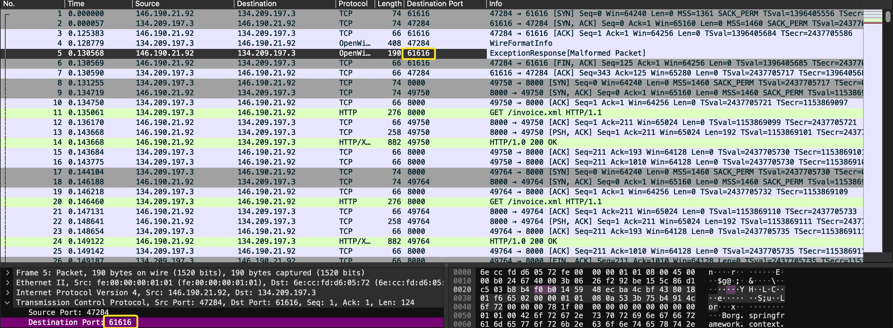
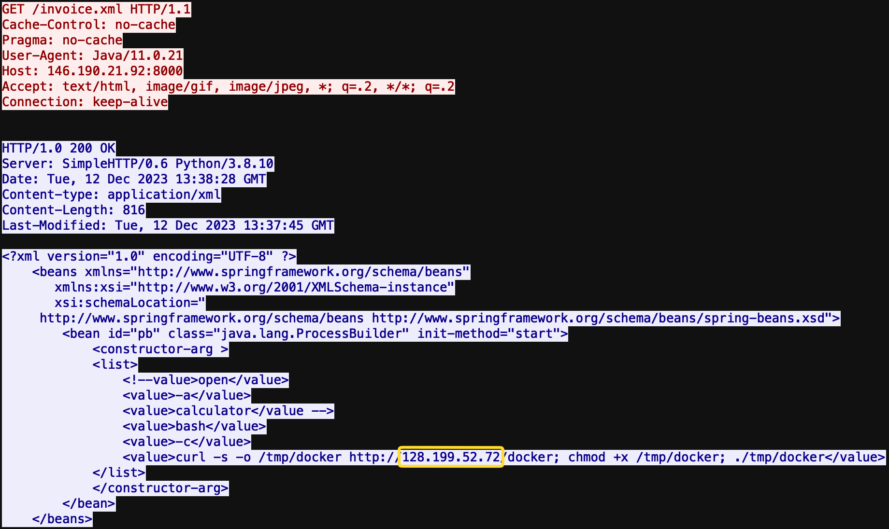
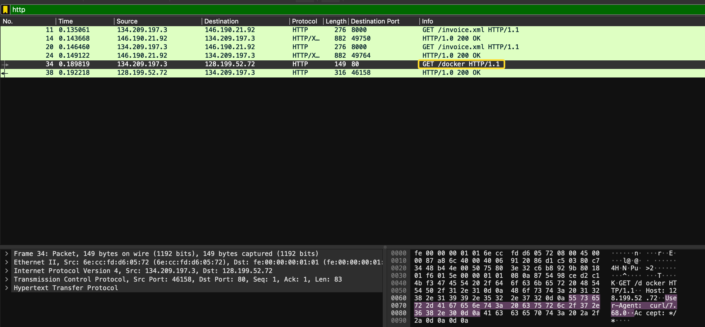
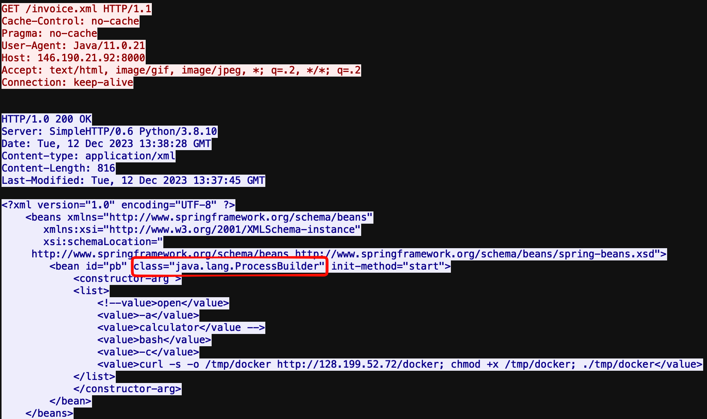
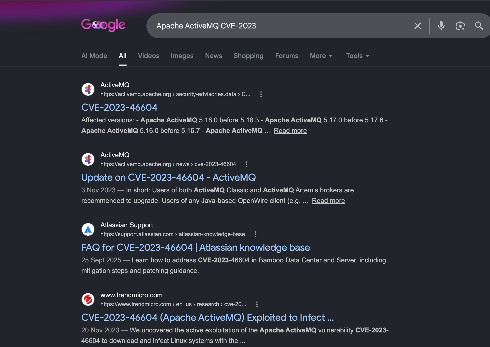
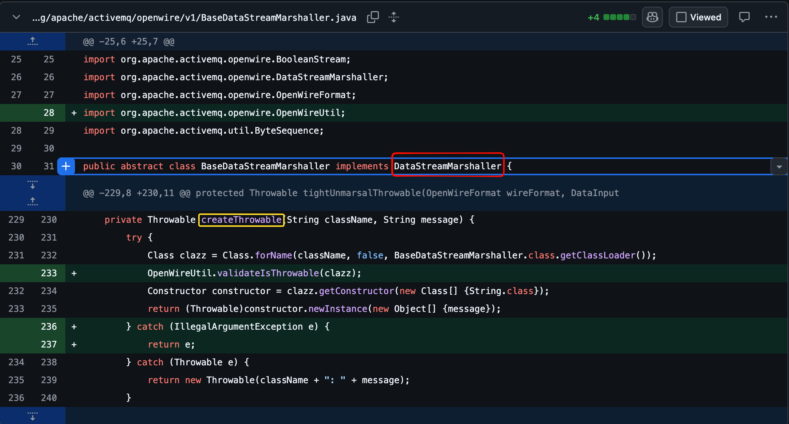

# OpenWire
Today we are investigating a Java deserialization vulnerability in Apache ActiveMQ that enables remote code execution through insecure class loading ([CyberDefenders](https://cyberdefenders.org/blueteam-ctf-challenges/openwire/)).

**Initial tactics**: Initial access, Execution, C2.
**Tools**: Wireshark, Zui, Network Miner.

**Q1**: By identifying the C2 IP, we can block traffic to and from this IP, helping to contain the breach and prevent further data exfiltration or command execution. Can you provide the IP of the C2 server that communicated with our server?

We can see in the first five packets the source IP address **146.190.21.92** is making connections, and thats our target.

**Q2**: Initial entry points are critical to trace the attack vector back. What is the port number of the service the adversary exploited?

As we can see in the first five packets as well, the destination port  **61616** is repeated and finally at packet five has an XML file sent to it.

Tip: You can right click on destination port inside the packet down below and apply it as a column on top for clearer view, you can do the same with other columns as well.

**Q3**: Following up on the previous question, what is the name of the service found to be vulnerable?

The port we found in the previous question, search the name of the service of the port and thats the answer.

**Q4**: The attacker's infrastructure often involves multiple components. What is the IP of the second C2 server?

After unpacking **Invoice.xml**, follow the HTTP stream of packet 14 to find the results of the xml file. 

**Q5**: Attackers usually leave traces on the disk. What is the name of the reverse shell executable dropped on the server?

In the previous question, we can see the attacker is dropping **docker** inside **temp**. We can also see docker pulled by GET in packet 34.

**Q6**: What Java class was invoked by the XML file to run the exploit?

Back to question 4, We can see the Java class declared.

**Q7**: To better understand the specific security flaw exploited, can you identify the CVE identifier associated with this vulnerability?

We know the vulnerability is port **61616** and the service is **Apache ActiveMQ**. We are given the CVE-2023-** as a hint. Search it up and you will find th answer.

**Q8**: The vendor addressed the vulnerability by adding a validation step to ensure that only valid `Throwable` classes can be instantiated, preventing exploitation. In which **Java class** and **method** was this validation step added?

The last question is a bit tricky if you are not familiar with Java classes and methods. After going 
Red is the class and yellow is the method.

